# Business Flow
## ContentFlow CMS

---

## Document Control

| Field | Value |
|---|---|
| Document | Business Flow |
| Product | ContentFlow CMS |
| Product Requirement Source | `docs/PRD.md` |
| Architecture Source | `docs/SYSTEM_DESIGN.md` |
| Scope | MVP / Version 1.0 |
| Document Status | Draft for Product, Engineering, QA, and Operations |
| Last Updated | 2026-08-29 |

---

# 1. Purpose

Dokumen ini mendefinisikan workflow bisnis utama ContentFlow CMS berdasarkan requirement produk dan arsitektur sistem yang telah ditetapkan.

Dokumen ini berfokus pada:

- siapa yang memulai proses;
- kondisi sebelum proses berjalan;
- alur utama;
- alur alternatif;
- alur error;
- aturan bisnis;
- perubahan state data;
- notifikasi;
- audit event;
- kondisi akhir.

Dokumen ini tidak berisi detail implementasi kode.

---

# 2. Workflow Scope

Workflow utama ContentFlow CMS meliputi:

1. User Account Administration
2. Authentication
3. Password Reset
4. Role & Permission Management
5. Post Creation
6. Post Editing
7. Post Publishing
8. Post Scheduling
9. Post Archiving
10. Page Management
11. Category Management
12. Tag Management
13. Media Upload
14. Media Deletion
15. Comment Submission
16. Comment Moderation
17. Menu Management
18. SEO Management
19. Site Settings Management
20. Dashboard & Operational Reporting
21. Search & Filtering
22. Notifications
23. Audit Trail Review
24. Scheduled Publishing
25. Account Deactivation
26. Administration Operations

Workflow berikut **tidak berlaku pada MVP ContentFlow CMS** karena tidak termasuk scope produk:

- Payment
- Payment Cancellation
- Inventory Movement
- Inventory Adjustment
- Order Fulfillment
- Subscription Billing
- Refund

---

# 3. Status Transition Reference

## 3.1 Post Status

Valid status:

```text
Draft
Scheduled
Published
Archived
```

### Valid Transitions

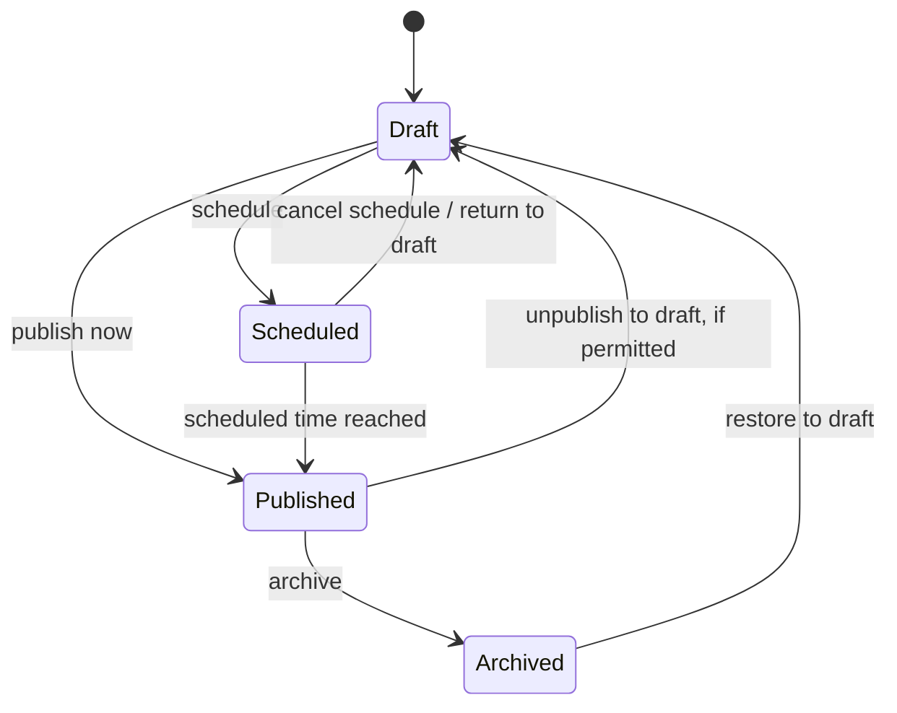

### Invalid Transitions

The following are not valid without an explicit intermediate state:

- Draft → Archived as normal publishing flow, unless archive action explicitly permits it
- Archived → Published directly
- Scheduled → Archived directly unless an archive action first resolves scheduled state
- Published → Scheduled without first returning to Draft or explicitly redefining publication state

---

## 3.2 Comment Status

Valid status:

```text
Pending
Approved
Spam
Rejected
```

### Valid Transitions

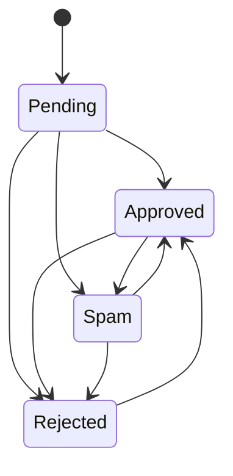

Public visibility rule:

```text
Approved = visible publicly
Pending = not visible publicly
Rejected = not visible publicly
Spam = not visible publicly
```

---

## 3.3 User Status

Valid status:

```text
Active
Inactive
```

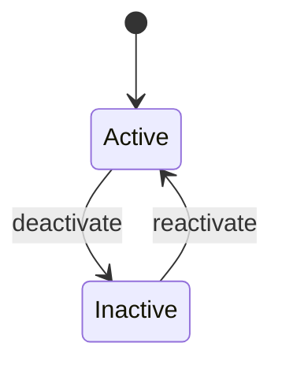

Inactive users cannot authenticate.

---

# 4. User Account Administration Workflow

## 4.1 Trigger

Administrator or Super Admin chooses to create a new user.

## 4.2 Actor

- Super Admin
- Administrator with user-management permission

## 4.3 Preconditions

- Actor is authenticated.
- Actor has permission to manage users.
- Email for new user is not already registered.
- At least one valid role is available.

## 4.4 Main Flow

1. Actor opens User Management.
2. Actor selects Create User.
3. Actor enters user information.
4. Actor assigns one or more roles.
5. Actor selects Active status.
6. System validates user input.
7. System validates email uniqueness.
8. System validates role assignment.
9. System creates user account.
10. System assigns selected role(s).
11. System records user creation activity.
12. System returns success feedback.

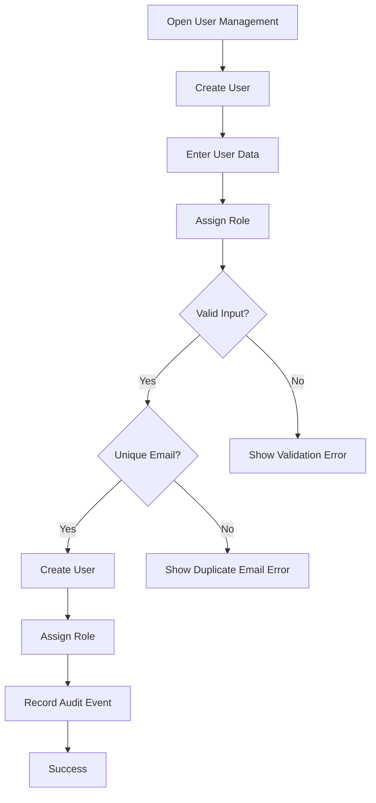

## 4.5 Alternative Flow

- Actor creates user with Inactive status.
- Actor assigns a different valid role set.
- Actor edits user after creation.

## 4.6 Error Flow

- Duplicate email.
- Invalid role.
- Actor lacks permission.
- Database operation fails.
- Role assignment fails after account creation.

If user creation and role assignment are treated as one business operation, partial persistence is not allowed.

## 4.7 Business Rules

- User email must be unique.
- User must have at least one valid role.
- Actor cannot create a user with capabilities beyond what actor is allowed to assign, if such restriction is enforced.
- At least one active Super Admin must remain available.

## 4.8 Database State Changes

Created:

```text
users
user_role relation
```

Possible activity log:

```text
USER_CREATED
ROLE_ASSIGNED
```

## 4.9 Notifications

Mandatory:
- in-app success/error feedback.

Optional future:
- account invitation email.

## 4.10 Audit Events

- User created
- Role assigned
- User activated/inactivated if changed

## 4.11 Final State

A valid user account exists with assigned role(s) and defined active status.

---

# 5. Authentication Workflow

## 5.1 Trigger

User submits login credentials.

## 5.2 Actor

- Author
- Editor
- Administrator
- Super Admin

## 5.3 Preconditions

- User account exists.
- Account is Active.
- User is not already blocked by another security rule.

## 5.4 Main Flow

1. User opens login page.
2. User enters email and password.
3. System validates required fields.
4. System locates account.
5. System verifies account is Active.
6. System verifies password.
7. System creates/regenerates authenticated session.
8. System redirects user to dashboard.

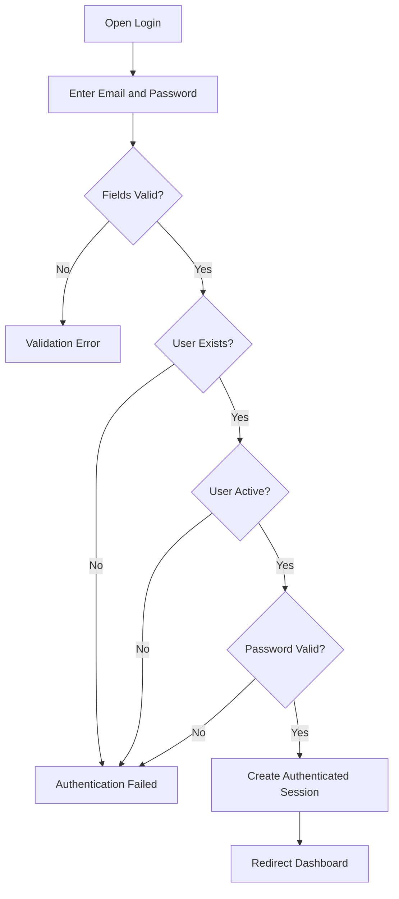

## 5.5 Alternative Flow

User initiates password reset.

## 5.6 Error Flow

- Invalid credential.
- Inactive account.
- Rate limit exceeded.
- Session creation failure.

## 5.7 Business Rules

- Inactive users cannot log in.
- Login failure should not disclose sensitive account details.
- Repeated attempts may be rate limited.

## 5.8 Database State Changes

Possible:
- session record created/updated.
- optional login activity record.

No core user record should be changed by a normal successful login.

## 5.9 Notifications

- login success redirect.
- login error feedback.

## 5.10 Audit Events

Optional MVP audit:
- successful login if enabled in activity scope.

## 5.11 Final State

User has an active authenticated session and can access permitted admin functions.

---

# 6. Password Reset Workflow

## 6.1 Trigger

User selects Forgot Password.

## 6.2 Actor

Registered user.

## 6.3 Preconditions

- User has an account.
- Account can receive configured email.
- Mail transport is available for delivery.

## 6.4 Main Flow

1. User submits email.
2. System validates input.
3. System initiates reset request.
4. System generates reset token.
5. System sends reset email.
6. User opens reset link.
7. User submits new password.
8. System validates reset token.
9. System validates password.
10. System updates password.
11. System confirms reset.

## 6.5 Alternative Flow

User requests another reset token.

## 6.6 Error Flow

- Invalid or expired token.
- Invalid password.
- Email delivery failure.
- Account not eligible.

## 6.7 Business Rules

- Reset token must be time-limited.
- Password cannot be returned in plaintext.
- Reset process must not expose sensitive account information.

## 6.8 Database State Changes

- password reset token created/updated.
- user password hash updated after successful reset.
- token invalidated or consumed.

## 6.9 Notifications

- password reset email.
- password reset success feedback.

## 6.10 Audit Events

Optional:
- password reset completed.

## 6.11 Final State

User can authenticate using the new password.

---

# 7. Role and Permission Management Workflow

## 7.1 Trigger

Authorized administrator changes a role or permission mapping.

## 7.2 Actor

- Super Admin
- Administrator if permitted by policy

## 7.3 Preconditions

- Actor is authenticated.
- Actor has role/permission management authority.
- Target role exists.

## 7.4 Main Flow

1. Actor opens Roles & Permissions.
2. Actor selects role.
3. Actor reviews available permissions.
4. Actor adds/removes permission.
5. System validates actor authority.
6. System validates permission set.
7. System saves mapping.
8. System records audit event.
9. New permission behavior applies on subsequent requests.

## 7.5 Alternative Flow

Actor creates a new role if the future product allows role creation.

## 7.6 Error Flow

- Actor lacks permission.
- Invalid permission.
- Operation would invalidate mandatory Super Admin control.
- Database operation fails.

## 7.7 Business Rules

- Permissions are the actual capability unit.
- Roles group permissions.
- Super Admin capability must not be accidentally eliminated.
- Permission changes must not silently leave stale authorization behavior.

## 7.8 Database State Changes

- role-permission relation inserted/deleted.

## 7.9 Notifications

- in-app success/error feedback.

## 7.10 Audit Events

- permission added to role.
- permission removed from role.
- role assignment changed.

## 7.11 Final State

Target role has the new effective permission set.

---

# 8. Post Creation Workflow

## 8.1 Trigger

Authorized user selects Create Post.

## 8.2 Actor

- Author
- Editor
- Administrator
- Super Admin

## 8.3 Preconditions

- User is authenticated.
- User has `posts.create`.
- Required content dependencies are available where applicable.

## 8.4 Main Flow

1. User opens Create Post.
2. User enters title.
3. System generates or accepts slug.
4. User enters content.
5. User optionally enters excerpt.
6. User optionally selects category.
7. User optionally assigns tags.
8. User optionally selects featured image.
9. User optionally enters SEO metadata.
10. User saves as Draft.
11. System validates input.
12. System stores post.
13. System records author.
14. System returns success feedback.

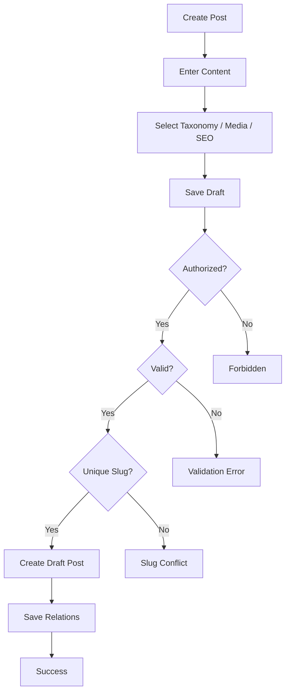

## 8.5 Alternative Flow

- User saves only minimal valid content as Draft.
- User previews content after initial save.
- Editor immediately publishes instead of leaving Draft, if authorized.

## 8.6 Error Flow

- Missing required fields.
- Duplicate slug.
- Invalid category/tag reference.
- Invalid featured image.
- User lacks permission.

## 8.7 Business Rules

- New non-published content is Draft unless actor explicitly invokes another permitted workflow.
- Draft is not public.
- Author identity must be retained.
- Slug must satisfy uniqueness rule.

## 8.8 Database State Changes

Created/updated:

```text
posts
post_category relation
post_tag relation
featured media relation/reference
SEO metadata
```

## 8.9 Notifications

- in-app "Draft saved" or equivalent.

## 8.10 Audit Events

Mandatory audit on draft creation is optional unless product audit scope expands.

## 8.11 Final State

A valid Draft post exists and is not publicly visible.

---

# 9. Post Editing Workflow

## 9.1 Trigger

Authorized user opens an existing post and saves changes.

## 9.2 Actor

- Author for own content
- Editor
- Administrator
- Super Admin

## 9.3 Preconditions

- Post exists.
- Actor can view and update target post.
- Ownership rules are satisfied.

## 9.4 Main Flow

1. Actor opens post.
2. System loads content and relationships.
3. Actor updates fields.
4. Actor saves.
5. System validates permission.
6. System validates new values.
7. System saves changes.
8. Related cache is invalidated if needed.
9. System returns success feedback.

## 9.5 Alternative Flow

- Actor previews without saving.
- Actor changes publication state using a dedicated status action.

## 9.6 Error Flow

- Actor lacks ownership/permission.
- Slug conflict.
- Referenced media/taxonomy invalid.
- Database save fails.

## 9.7 Business Rules

- Editing does not automatically change publication status unless explicit product behavior says so.
- Editing a Scheduled post must not silently invalidate scheduled time.
- Editing a Published post must preserve public status unless user explicitly changes state.

## 9.8 Database State Changes

- post fields updated.
- taxonomy/media/SEO relationships updated if changed.

## 9.9 Notifications

- in-app save success/error.

## 9.10 Audit Events

Optional for normal edit.
Mandatory if edit also triggers publication state or administrative event.

## 9.11 Final State

Post retains valid status with updated content.

---

# 10. Post Publish Now Workflow

## 10.1 Trigger

Authorized user selects Publish.

## 10.2 Actor

- Editor
- Administrator
- Super Admin
- Other role only if explicitly granted publish permission

## 10.3 Preconditions

- Post exists.
- Actor has publish permission.
- Post content meets publishing validation.
- Slug is valid and unique.

## 10.4 Main Flow

1. Actor opens Draft.
2. Actor selects Publish.
3. System checks authorization.
4. System validates publishable content.
5. System starts state change.
6. System sets status = Published.
7. System sets publication timestamp.
8. System commits changes.
9. System invalidates relevant public cache.
10. System records `POST_PUBLISHED`.
11. System returns success.
12. Public page becomes available.

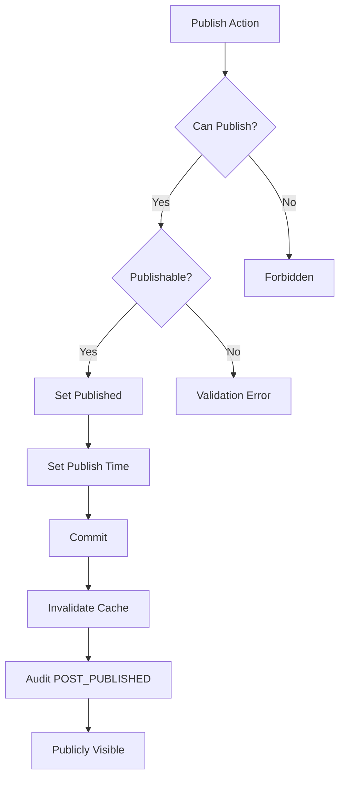

## 10.5 Alternative Flow

Actor schedules post instead of publishing immediately.

## 10.6 Error Flow

- Permission denied.
- Validation failure.
- Invalid slug.
- Database transaction fails.

## 10.7 Business Rules

- Only authorized roles may publish.
- A post must never become public if publish transaction fails.
- Publication event should occur once per successful publication action.

## 10.8 Database State Changes

```text
posts.status = Published
posts.publish_at = current effective publish time
```

Possible related audit record created.

## 10.9 Notifications

- in-app publish success.
- no email required for MVP.

## 10.10 Audit Events

- POST_PUBLISHED

## 10.11 Final State

Post is Published and publicly visible.

---

# 11. Post Scheduling Workflow

## 11.1 Trigger

Authorized user chooses Scheduled and a future publication time.

## 11.2 Actor

- Editor
- Administrator
- Super Admin
- Other role with schedule permission

## 11.3 Preconditions

- Post exists.
- Actor can schedule.
- Future date/time is valid.
- Post is publishable enough to enter Scheduled state.

## 11.4 Main Flow

1. Actor selects Scheduled.
2. Actor enters future date/time.
3. System checks permission.
4. System validates date/time.
5. System validates publication requirements.
6. System sets status = Scheduled.
7. System stores publication time.
8. System returns success.
9. Scheduled task later evaluates eligibility.

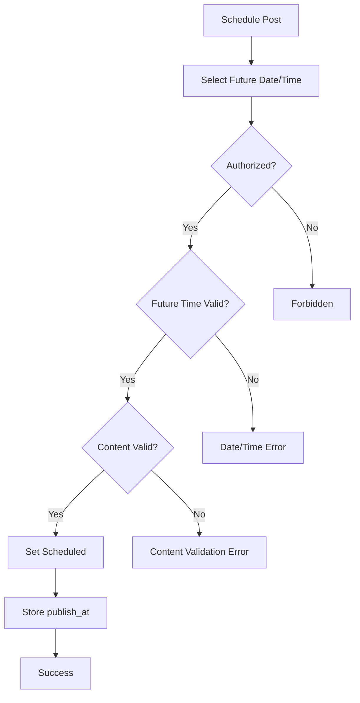

## 11.5 Alternative Flow

- Actor cancels scheduling and returns post to Draft.
- Actor publishes immediately.

## 11.6 Error Flow

- publication time in past;
- invalid timezone interpretation;
- actor lacks permission;
- post validation fails.

## 11.7 Business Rules

- Scheduled time must be in the future at scheduling time.
- Scheduled content is not public before eligibility time.
- Publication uses configured application/site timezone consistently.

## 11.8 Database State Changes

```text
posts.status = Scheduled
posts.publish_at = selected future timestamp
```

## 11.9 Notifications

- in-app scheduling success.

## 11.10 Audit Events

Optional:
- POST_SCHEDULED

## 11.11 Final State

Post is Scheduled and not publicly visible until scheduled publishing succeeds.

---

# 12. Scheduled Publishing Execution Workflow

## 12.1 Trigger

Laravel Scheduler runs the scheduled publishing process.

## 12.2 Actor

System scheduler.

## 12.3 Preconditions

- Post status = Scheduled.
- publish_at <= current effective time.
- Post remains valid for publication.

## 12.4 Main Flow

1. Scheduler starts job/command.
2. System finds eligible Scheduled posts.
3. For each post, system re-checks eligibility.
4. System invokes the same publication business action used by manual publishing where appropriate.
5. Post becomes Published.
6. Public cache is invalidated.
7. Audit event is recorded.
8. Scheduler continues to next eligible post.

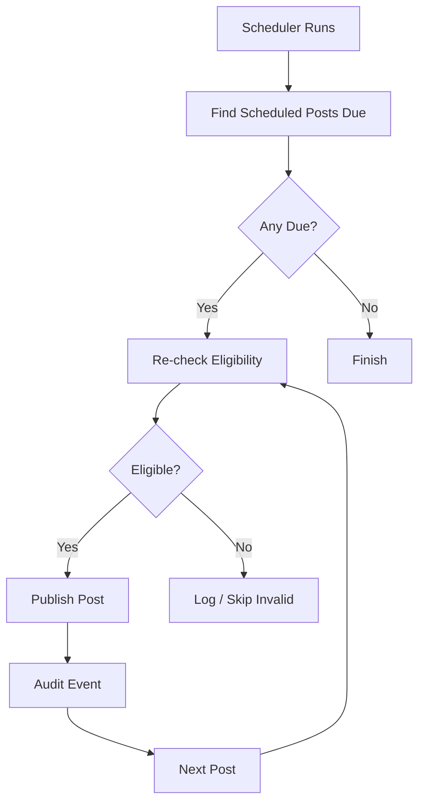

## 12.5 Alternative Flow

No scheduled post is due; process exits cleanly.

## 12.6 Error Flow

- one post fails publication;
- scheduler overlap;
- database unavailable;
- job throws exception.

Failure of one post should not silently mark it Published.

## 12.7 Business Rules

- Scheduled publish must be idempotent.
- A post should not produce duplicate publication side effects.
- Eligibility must be re-evaluated at execution time.

## 12.8 Database State Changes

For successful item:

```text
status: Scheduled → Published
publish_at retained or normalized
activity log created
```

## 12.9 Notifications

MVP:
- technical failure logged.
- no mandatory user email.

## 12.10 Audit Events

- POST_PUBLISHED
- optional POST_SCHEDULE_FAILURE for future operational detail

## 12.11 Final State

Each successfully processed eligible post is Published.

---

# 13. Post Archive Workflow

## 13.1 Trigger

Authorized user selects Archive.

## 13.2 Actor

- Editor
- Administrator
- Super Admin
- Other role if permission exists

## 13.3 Preconditions

- Post exists.
- Actor can archive/update target post.
- Post is in a valid state for archive.

## 13.4 Main Flow

1. Actor opens post.
2. Actor selects Archive.
3. System checks permission.
4. System changes status to Archived.
5. System saves.
6. Public cache is invalidated.
7. System records audit event.
8. System returns success.

## 13.5 Alternative Flow

Actor instead returns Published post to Draft where product behavior permits.

## 13.6 Error Flow

- Permission denied.
- Invalid transition.
- Save fails.

## 13.7 Business Rules

- Archived posts are not shown in normal public listings.
- Archive is not the same as delete.
- Archived content remains retained unless explicitly deleted.

## 13.8 Database State Changes

```text
posts.status = Archived
```

## 13.9 Notifications

- in-app archive success.

## 13.10 Audit Events

- POST_ARCHIVED

## 13.11 Final State

Post remains stored but is not part of normal public content listings.

---

# 14. Page Management Workflow

## 14.1 Trigger

Authorized user creates or edits a page.

## 14.2 Actor

- Editor
- Administrator
- Super Admin

## 14.3 Preconditions

- Actor is authenticated.
- Actor has page permission.

## 14.4 Main Flow

1. Actor opens Pages.
2. Actor creates or selects a page.
3. Actor enters title, slug, content, SEO.
4. Actor saves as Draft or Published.
5. System validates.
6. System saves.
7. If Published, public route becomes available.
8. System returns success.

## 14.5 Alternative Flow

Page is archived instead of published.

## 14.6 Error Flow

- duplicate slug;
- unauthorized action;
- validation error.

## 14.7 Business Rules

- Draft page is not public.
- Published page is publicly accessible.
- Page slug must be unique within its namespace.

## 14.8 Database State Changes

- page created/updated.
- SEO metadata updated.
- optional media references updated.

## 14.9 Notifications

- in-app save/publish feedback.

## 14.10 Audit Events

- publish/archive events may be recorded depending on audit scope.

## 14.11 Final State

Page exists in a valid status.

---

# 15. Category Management Workflow

## 15.1 Trigger

Authorized user creates, edits, or deletes a category.

## 15.2 Actor

- Editor
- Administrator
- Super Admin

## 15.3 Preconditions

- Actor has category management permission.

## 15.4 Main Flow — Create/Update

1. Actor opens Categories.
2. Actor enters name and slug.
3. System validates.
4. System checks slug uniqueness.
5. System saves category.
6. System returns success.

## 15.5 Alternative Flow

Actor chooses to delete category.

## 15.6 Error Flow

- duplicate slug;
- invalid data;
- category has relationships that cannot be safely removed.

## 15.7 Business Rules

- Category slug must be unique.
- Deleting category must not silently corrupt or orphan content.
- Existing post relations must be explicitly handled.

## 15.8 Database State Changes

- category inserted/updated/deleted.
- relationship changes only when explicitly approved by business rule.

## 15.9 Notifications

- in-app success/error.

## 15.10 Audit Events

Optional:
- category created/updated/deleted.

## 15.11 Final State

Taxonomy remains valid and content relationships remain consistent.

---

# 16. Tag Management Workflow

## 16.1 Trigger

Authorized user creates, updates, or deletes a tag.

## 16.2 Actor

- Author where permission permits
- Editor
- Administrator
- Super Admin

## 16.3 Preconditions

Actor has permission to manage or assign tags.

## 16.4 Main Flow

1. Actor opens Tags or adds tag from content workflow.
2. Actor enters tag name/slug.
3. System validates.
4. System checks uniqueness.
5. System saves tag.

## 16.5 Alternative Flow

Existing tag is selected instead of creating a new one.

## 16.6 Error Flow

- duplicate slug;
- invalid input;
- unauthorized creation/deletion.

## 16.7 Business Rules

- Tag slug must be unique.
- Post may have zero or more tags.

## 16.8 Database State Changes

- tag inserted/updated/deleted.
- post-tag relation inserted/deleted.

## 16.9 Notifications

- in-app success/error.

## 16.10 Audit Events

Optional.

## 16.11 Final State

Tag taxonomy remains valid.

---

# 17. Media Upload Workflow

## 17.1 Trigger

Authorized user selects/upload a file.

## 17.2 Actor

- Author
- Editor
- Administrator
- Super Admin

## 17.3 Preconditions

- Actor has media upload permission.
- File meets configured upload policy.

## 17.4 Main Flow

1. Actor selects file.
2. System validates permission.
3. System validates file type.
4. System validates file size.
5. System uploads file.
6. System stores file metadata.
7. Actor may add/edit alt text.
8. Media appears in Media Library.

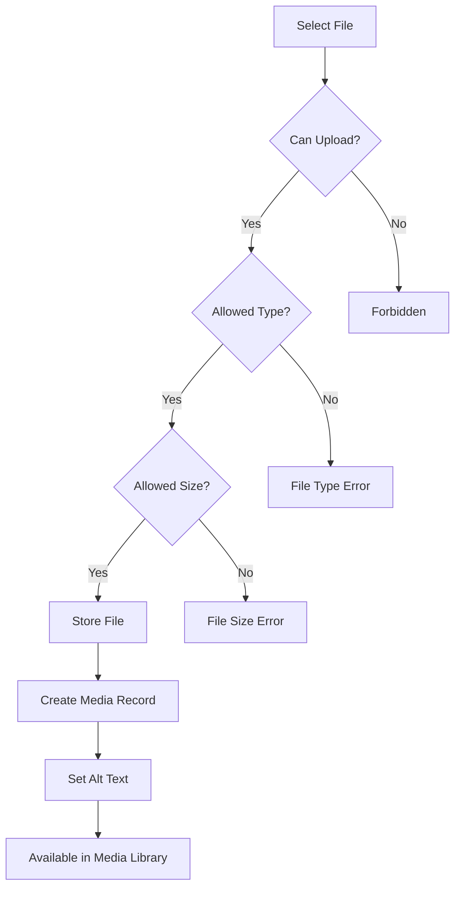

## 17.5 Alternative Flow

User selects existing media instead of uploading new file.

## 17.6 Error Flow

- invalid file type;
- file exceeds size limit;
- storage failure;
- partial upload;
- metadata save failure.

## 17.7 Business Rules

- Invalid files must not become valid media records.
- Duplicate filename must not silently overwrite another file.
- Image should support alt text.

## 17.8 Database State Changes

- media record created.
- file path/storage metadata saved.

## 17.9 Notifications

- upload success/error.

## 17.10 Audit Events

Optional:
- MEDIA_UPLOADED.

## 17.11 Final State

Media is available for authorized reuse.

---

# 18. Media Deletion Workflow

## 18.1 Trigger

Authorized user selects Delete Media.

## 18.2 Actor

- Administrator
- Super Admin
- Editor/Author only if explicitly permitted

## 18.3 Preconditions

- Media exists.
- Actor can delete.
- Reference state can be evaluated.

## 18.4 Main Flow

1. Actor selects media.
2. System checks authorization.
3. System checks whether media is referenced.
4. If unreferenced, deletion may proceed.
5. System deletes physical file.
6. System deletes media record.
7. System returns success.

## 18.5 Alternative Flow

If referenced:
- system warns actor;
- deletion is blocked or requires explicit resolution defined by product behavior.

## 18.6 Error Flow

- storage delete fails;
- database delete fails;
- actor lacks permission;
- media is protected/referenced.

## 18.7 Business Rules

- Referenced media cannot silently disappear.
- Successful UI deletion means file and metadata are consistently resolved.

## 18.8 Database State Changes

- media record deleted if deletion succeeds.
- references resolved/removed only under explicit rule.

## 18.9 Notifications

- warning for referenced file.
- success/error feedback.

## 18.10 Audit Events

Optional:
- MEDIA_DELETED.

## 18.11 Final State

Media is either safely retained or fully removed without silent broken references.

---

# 19. Comment Submission Workflow

## 19.1 Trigger

Public visitor submits a comment on content where comments are enabled.

## 19.2 Actor

Public Visitor.

## 19.3 Preconditions

- Target content exists.
- Target content permits comments.
- Comment form is available.
- Submission passes validation/security controls.

## 19.4 Main Flow

1. Visitor opens published content.
2. Visitor submits comment data.
3. System validates input.
4. System stores comment as Pending by default.
5. Comment is not shown publicly.
6. System returns submission feedback.

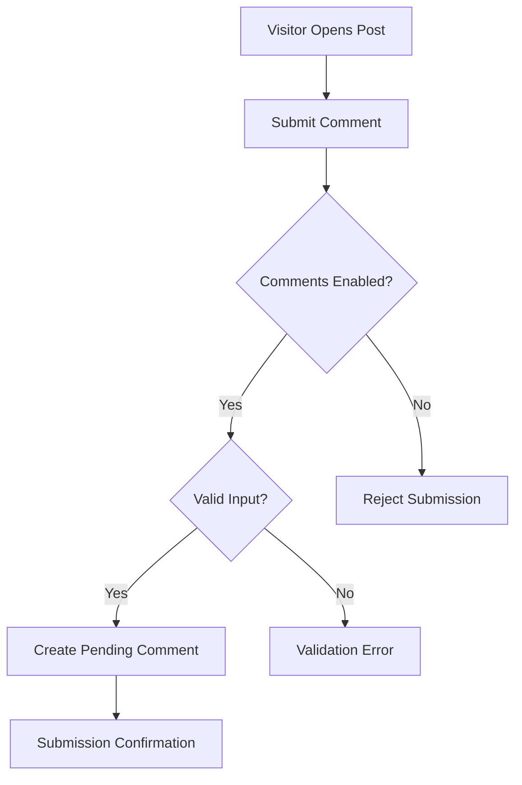

## 19.5 Alternative Flow

If product setting later allows auto-approval under explicit configured rule, flow may create Approved directly. Default MVP remains Pending.

## 19.6 Error Flow

- comments disabled;
- validation failed;
- suspected malicious content;
- target post no longer public.

## 19.7 Business Rules

- Default new comment = Pending.
- Pending comment is not public.
- Only Approved is public.

## 19.8 Database State Changes

```text
comments.status = Pending
```

## 19.9 Notifications

- visitor receives submission acknowledgement.
- no mandatory editor email in MVP.

## 19.10 Audit Events

No mandatory audit for every public submission.

## 19.11 Final State

Comment exists in Pending moderation state.

---

# 20. Comment Moderation Workflow

## 20.1 Trigger

Authorized editor reviews a comment.

## 20.2 Actor

- Editor
- Administrator
- Super Admin

## 20.3 Preconditions

- Comment exists.
- Actor has moderation permission.

## 20.4 Main Flow

1. Actor opens Comments.
2. Actor filters Pending comments.
3. Actor opens comment.
4. Actor chooses Approved, Spam, or Rejected.
5. System checks authorization.
6. System updates status.
7. Public visibility changes according to new status.
8. System returns success.

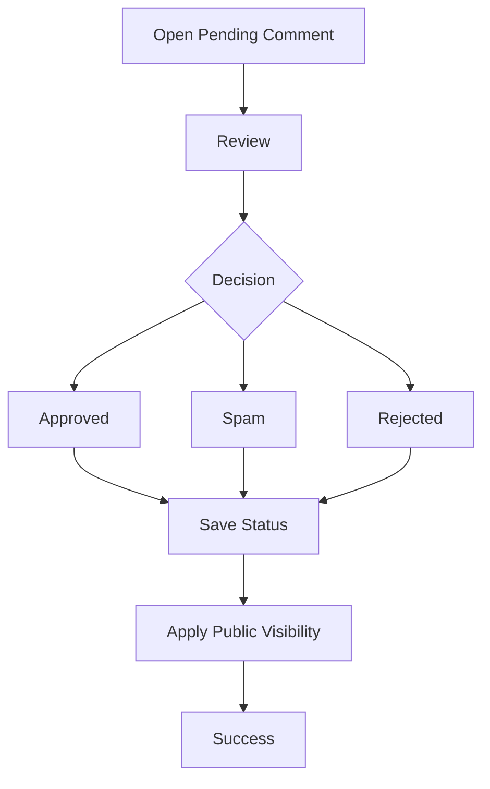

## 20.5 Alternative Flow

Actor reclassifies:
- Approved → Spam
- Approved → Rejected
- Rejected → Approved
- Spam → Approved/Rejected

## 20.6 Error Flow

- permission denied;
- comment already deleted;
- database update fails.

## 20.7 Business Rules

- Approved only = public.
- Spam/Rejected/Pending = not public.
- Moderation must not depend on client-side UI alone.

## 20.8 Database State Changes

```text
comments.status = selected valid status
```

## 20.9 Notifications

- in-app moderation success.

## 20.10 Audit Events

Optional:
- COMMENT_MODERATED

## 20.11 Final State

Comment is stored with a valid moderation state and correct public visibility.

---

# 21. Menu Management Workflow

## 21.1 Trigger

Authorized administrator edits navigation.

## 21.2 Actor

- Administrator
- Super Admin

## 21.3 Preconditions

- Actor has menu management permission.
- Target internal content exists if referenced.

## 21.4 Main Flow

1. Actor opens Menu Manager.
2. Actor selects menu.
3. Actor adds, removes, edits, or reorders items.
4. System validates links.
5. System validates permission.
6. System saves menu structure.
7. Menu cache is invalidated.
8. Public navigation reflects the saved structure.

## 21.5 Alternative Flow

Menu item points to:
- Page
- Post
- Category
- Custom URL

## 21.6 Error Flow

- invalid custom URL;
- referenced content no longer exists;
- save fails;
- actor lacks permission.

## 21.7 Business Rules

- Menu order must persist.
- Public navigation reflects the latest valid saved menu.
- Invalid references must not be silently saved if product can detect them.

## 21.8 Database State Changes

- menu created/updated.
- menu item inserted/updated/deleted/reordered.

## 21.9 Notifications

- in-app save success/error.

## 21.10 Audit Events

Optional:
- MENU_UPDATED

## 21.11 Final State

Public navigation uses the latest valid menu structure.

---

# 22. SEO Management Workflow

## 22.1 Trigger

Authorized user edits SEO fields or global defaults.

## 22.2 Actor

Content-level:
- Editor
- Administrator
- Super Admin
- Other role if permission permits

Global:
- Administrator
- Super Admin

## 22.3 Preconditions

- Target post/page or site settings exist.
- Actor has relevant permission.

## 22.4 Main Flow

1. Actor opens content or SEO settings.
2. Actor enters SEO title/meta description.
3. Actor optionally selects Open Graph image.
4. Actor selects index/noindex if applicable.
5. System validates.
6. System saves metadata.
7. Public rendering uses content-specific value.
8. If empty, system uses defined global fallback.

## 22.5 Alternative Flow

Content-level field left empty; global/default fallback is used.

## 22.6 Error Flow

- invalid media reference;
- unauthorized global setting change;
- save failure.

## 22.7 Business Rules

- Content-specific value overrides global default.
- Fallback behavior must be predictable.
- Draft content remains non-public regardless of SEO settings.

## 22.8 Database State Changes

- SEO metadata updated.
- global SEO setting updated if applicable.

## 22.9 Notifications

- in-app save feedback.

## 22.10 Audit Events

Global SEO settings update should be included in site settings audit scope.

## 22.11 Final State

Content or site has valid SEO metadata/fallback behavior.

---

# 23. Site Settings Workflow

## 23.1 Trigger

Authorized administrator changes site configuration.

## 23.2 Actor

- Administrator
- Super Admin

## 23.3 Preconditions

- Actor has `settings.manage`.

## 23.4 Main Flow

1. Actor opens Settings.
2. Actor edits supported settings.
3. System validates values.
4. System saves new values.
5. System invalidates settings cache.
6. System records audit event.
7. Public/admin areas use new values.

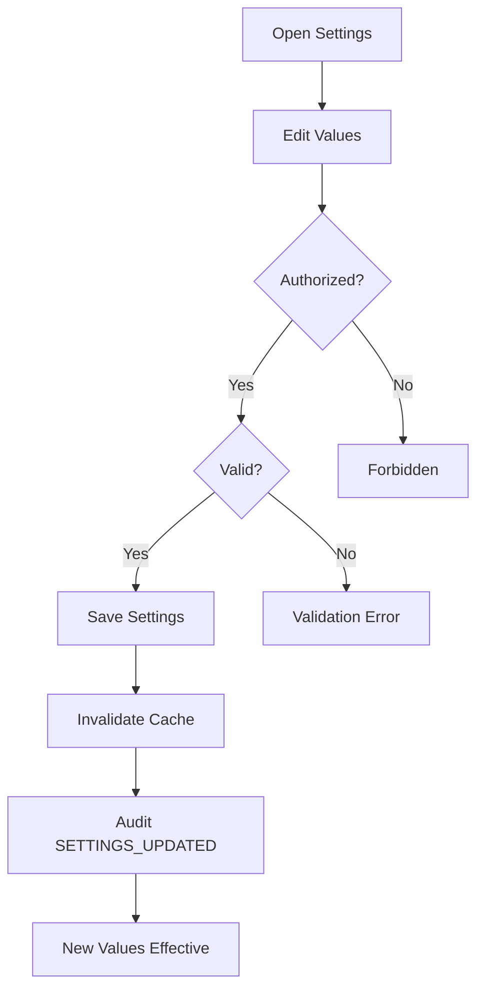

## 23.5 Alternative Flow

Actor changes only one settings group such as branding or SEO.

## 23.6 Error Flow

- actor unauthorized;
- invalid setting;
- invalid media reference;
- save failure.

## 23.7 Business Rules

- Only approved settings are editable.
- Settings changes must be globally consistent.
- No customer-specific hard-coded behavior is introduced.

## 23.8 Database State Changes

- site setting values updated.

## 23.9 Notifications

- in-app settings save success/error.

## 23.10 Audit Events

- SETTINGS_UPDATED

## 23.11 Final State

Latest valid site settings are authoritative and effective.

---

# 24. Dashboard Workflow

## 24.1 Trigger

Authenticated user opens dashboard.

## 24.2 Actor

- Author
- Editor
- Administrator
- Super Admin

## 24.3 Preconditions

- User authenticated.
- User has dashboard access.

## 24.4 Main Flow

1. User opens dashboard.
2. System evaluates permissions.
3. System retrieves allowed summary counts.
4. System retrieves recent content.
5. System retrieves scheduled content.
6. System retrieves pending comments if user can view them.
7. System renders only authorized widgets.

## 24.5 Alternative Flow

Author sees a reduced dashboard.

## 24.6 Error Flow

- user session expired;
- summary query fails;
- some widget data unavailable.

## 24.7 Business Rules

- User sees only data they are authorized to access.
- Dashboard is operational, not BI analytics.

## 24.8 Database State Changes

None for read-only dashboard view.

## 24.9 Notifications

None mandatory.

## 24.10 Audit Events

Dashboard read does not require audit.

## 24.11 Final State

User receives current authorized operational summary.

---

# 25. Search and Filtering Workflow

## 25.1 Trigger

User enters search query or filter.

## 25.2 Actor

Authorized admin user.

## 25.3 Preconditions

- User can access target module.
- Search/filter values are valid.

## 25.4 Main Flow

1. User opens list.
2. User enters search/filter criteria.
3. System validates parameters.
4. System applies permission scope.
5. System executes filtered query.
6. System returns paginated results.
7. Active filters remain visible.

## 25.5 Alternative Flow

User resets all filters.

## 25.6 Error Flow

- invalid filter;
- query failure;
- no results.

No results must produce empty-state, not an error page.

## 25.7 Business Rules

- Search must not bypass authorization.
- Pagination is required for larger result sets.
- Active filters must be visible.

## 25.8 Database State Changes

None.

## 25.9 Notifications

No result:
- empty-state information.

## 25.10 Audit Events

None.

## 25.11 Final State

User receives authorized result set matching criteria.

---

# 26. Audit Trail Review Workflow

## 26.1 Trigger

Authorized administrator opens activity/audit trail.

## 26.2 Actor

- Super Admin
- Administrator
- Editor only if explicitly granted

## 26.3 Preconditions

- Actor has audit view permission.

## 26.4 Main Flow

1. Actor opens Audit Trail.
2. System checks permission.
3. System retrieves audit records.
4. System displays actor, action, target, timestamp.
5. Actor may filter/read records if supported.

## 26.5 Alternative Flow

No records match selected filter.

## 26.6 Error Flow

- permission denied;
- query failure.

## 26.7 Business Rules

- Audit trail is operational accountability, not immutable regulatory ledger.
- Ordinary users cannot modify audit entries.
- Sensitive secret values must not appear in audit metadata.

## 26.8 Database State Changes

None for view operation.

## 26.9 Notifications

None.

## 26.10 Audit Events

Viewing audit trail does not itself require audit in MVP.

## 26.11 Final State

Authorized actor can review historical administrative actions.

---

# 27. User Deactivation Workflow

## 27.1 Trigger

Authorized admin deactivates a user.

## 27.2 Actor

- Super Admin
- Administrator with user management permission

## 27.3 Preconditions

- Target user exists.
- Actor has permission.
- Operation does not leave system without required active Super Admin.

## 27.4 Main Flow

1. Actor opens user.
2. Actor selects Deactivate.
3. System validates actor authority.
4. System checks Super Admin safety rule.
5. System updates status to Inactive.
6. System records audit event.
7. Future login attempts are rejected.

## 27.5 Alternative Flow

Inactive user is reactivated.

## 27.6 Error Flow

- target is last active Super Admin;
- actor lacks permission;
- save fails.

## 27.7 Business Rules

- Inactive user cannot authenticate.
- Deactivation must not delete authored content.
- Content attribution must remain intact.

## 27.8 Database State Changes

```text
users.status = Inactive
```

## 27.9 Notifications

- in-app status change confirmation.

## 27.10 Audit Events

- USER_DEACTIVATED
- USER_REACTIVATED

## 27.11 Final State

User account remains stored but authentication eligibility matches status.

---

# 28. Notification Workflow

## 28.1 Trigger

A business operation requires immediate user feedback or queued email.

## 28.2 Actor

System.

## 28.3 Preconditions

For UI notification:
- initiating request exists.

For email:
- valid recipient context exists;
- mail transport configured.

## 28.4 Main Flow — UI Feedback

1. Business operation completes.
2. System receives success/failure result.
3. System displays corresponding feedback.
4. User can continue workflow.

## 28.5 Main Flow — Email

1. Application determines email is required.
2. Job/notification is queued where appropriate.
3. Queue worker processes message.
4. Mail provider accepts or rejects delivery.
5. Failure is retried/logged according to policy.

## 28.6 Alternative Flow

Email cannot be delivered immediately and is retried.

## 28.7 Error Flow

- SMTP unavailable;
- invalid configuration;
- queue failure.

## 28.8 Business Rules

- UI success must correspond to committed business state.
- Email is not the source of truth for the business operation.
- Password reset email is mandatory behavior.

## 28.9 Database State Changes

Possible:
- queue job row created/removed.
- failed job stored if terminal failure.

## 28.10 Notifications

This workflow itself produces:
- UI feedback;
- email where required.

## 28.11 Audit Events

Mail technical failures belong to technical logs, not necessarily business audit.

## 28.12 Final State

User receives immediate application feedback; queued email is delivered or recorded as failed/retryable.

---

# 29. Operational Reporting Workflow

## 29.1 Trigger

Authorized user opens dashboard/reporting list.

## 29.2 Actor

- Editor
- Administrator
- Super Admin
- Author for own allowed scope

## 29.3 Preconditions

- Actor authenticated.
- Actor allowed to see requested data.

## 29.4 Main Flow

1. Actor selects dashboard or content list.
2. System applies authorization scope.
3. System calculates/retrieves counts.
4. System applies filters.
5. System returns paginated report data.

## 29.5 Alternative Flow

Actor views a subset such as Scheduled only.

## 29.6 Error Flow

- unauthorized query;
- invalid filter;
- database query failure.

## 29.7 Business Rules

MVP reporting is limited to:
- content status counts;
- recent content;
- scheduled content;
- pending comments;
- filtered content lists.

No revenue, conversion, or traffic analytics in MVP.

## 29.8 Database State Changes

None.

## 29.9 Notifications

None mandatory.

## 29.10 Audit Events

None.

## 29.11 Final State

Actor receives authorized operational report data.

---

# 30. Administration Workflow

## 30.1 Trigger

Administrator performs a system administration task.

## 30.2 Actor

- Administrator
- Super Admin

## 30.3 Preconditions

- authenticated;
- appropriate permission.

## 30.4 Main Flow

Administration may involve:

```text
Users
→ Roles & Permissions
→ Menus
→ Settings
→ SEO Defaults
→ Media Administration
→ Audit Review
```

General pattern:

1. Actor opens administrative module.
2. System verifies authorization.
3. Actor makes change.
4. System validates.
5. System persists change.
6. System invalidates cache if relevant.
7. System records required audit event.
8. System returns success feedback.

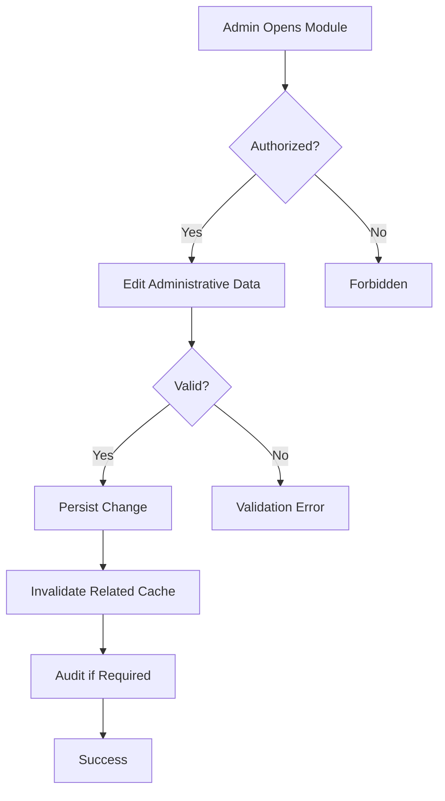

## 30.5 Alternative Flow

Actor cancels before save; no state changes occur.

## 30.6 Error Flow

- permission denied;
- invalid configuration;
- relationship conflict;
- persistence failure.

## 30.7 Business Rules

- Administrative changes must follow same product/business rules as normal workflows.
- Direct database manipulation is not part of supported product workflow.
- Protected changes must be auditable where required.

## 30.8 Database State Changes

Depends on module.

## 30.9 Notifications

- in-app success/error.

## 30.10 Audit Events

Required according to audit scope.

## 30.11 Final State

Administrative state is valid, persisted, and effective.

---

# 31. Approval Process Applicability

ContentFlow CMS MVP does **not** define a multi-step formal approval workflow such as:

```text
Author
→ Reviewer
→ Senior Editor
→ Publisher
```

The current product uses a simpler permission-based editorial workflow:

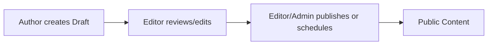

## Current Approval Interpretation

The practical approval boundary is:

- Author can create/manage own Draft.
- Author cannot Publish by default.
- Editor/Administrator/Super Admin can publish if permitted.

Therefore "approval" in MVP is represented by **publish permission**, not by a separate approval-state entity.

Future versions may introduce explicit states such as:

```text
Draft
In Review
Approved
Scheduled
Published
Archived
```

but this is not part of MVP.

---

# 32. Payment Workflow Applicability

**Not Applicable to ContentFlow CMS MVP.**

Reason:

The PRD explicitly excludes:

- SaaS subscription billing;
- e-commerce;
- payment gateway;
- paid membership;
- paywall.

No payment workflow shall be implemented in the MVP.

---

# 33. Cancellation Workflow Applicability

A generic financial/order cancellation workflow is not applicable.

The closest domain-equivalent workflows are:

1. Cancel Scheduled Publication
2. Unpublish Published Content
3. Deactivate User
4. Reject Comment

## 33.1 Cancel Scheduled Publication

### Trigger
Authorized user cancels a Scheduled post.

### Actor
Editor / Administrator / Super Admin.

### Preconditions
Post status = Scheduled.

### Main Flow
1. Actor opens Scheduled post.
2. Actor selects Return to Draft / Cancel Schedule.
3. System checks permission.
4. System clears or deactivates scheduled publication intent.
5. Status becomes Draft.
6. Post remains non-public.

### Database State Change

```text
status: Scheduled → Draft
publish_at: cleared or retained only if product explicitly preserves it
```

### Final State
Post is Draft and will not publish automatically.

---

# 34. Inventory Movement Applicability

**Not Applicable to ContentFlow CMS.**

ContentFlow does not manage:

- physical goods;
- warehouse stock;
- stock in/out;
- quantity movements;
- inventory valuation.

Media Library is not inventory and must not be modeled as stock movement.

---

# 35. Cross-Module Workflow: Publish Content with Media, Taxonomy, SEO, and Menu Discovery

This is the primary end-to-end transaction-like workflow in the CMS domain.

## 35.1 Trigger

Editor prepares content for publication.

## 35.2 Actor

Editor / Administrator / Super Admin.

## 35.3 Preconditions

- Actor authenticated.
- Actor has publish permission.
- Post exists.
- Related media/taxonomy references are valid.

## 35.4 Main Flow

1. Actor edits Draft.
2. Actor assigns Category.
3. Actor assigns Tags.
4. Actor selects Featured Image.
5. Actor completes SEO.
6. Actor previews content.
7. Actor selects Publish.
8. System validates full publication state.
9. System commits publication.
10. System invalidates public cache.
11. Public page becomes visible.
12. Category/tag listings can discover the post.
13. SEO metadata is rendered.
14. If linked from a menu, navigation resolves it.
15. Audit event is recorded.

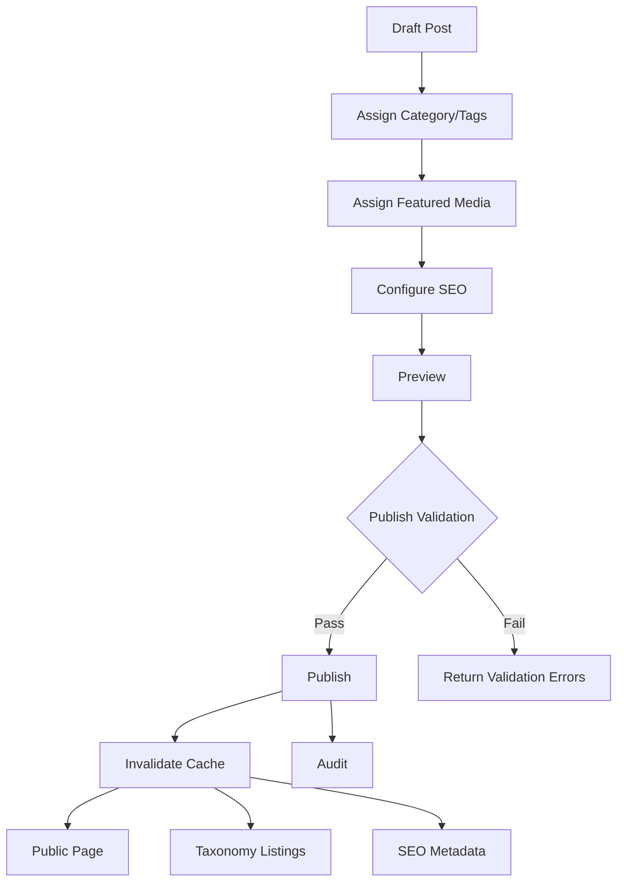

## 35.5 Alternative Flow

Actor schedules instead of publishing immediately.

## 35.6 Error Flow

Any invalid related resource prevents successful publication where required by product rules.

## 35.7 Business Rules

- Public visibility depends primarily on content status/time.
- Related metadata cannot override Draft/Scheduled privacy.
- Invalid media or taxonomy reference must not silently corrupt public rendering.

## 35.8 Database State Changes

May include:

- post update;
- category relation;
- tag relation;
- media reference;
- SEO metadata;
- publication status;
- activity log.

## 35.9 Notifications

- publish success.
- validation error where applicable.

## 35.10 Audit Events

- POST_PUBLISHED

## 35.11 Final State

Content is publicly discoverable according to its valid publication and navigation/taxonomy context.

---

# 36. Global Business Rules Summary

## BR-GLOBAL-001
Only authenticated and authorized users may access protected admin actions.

## BR-GLOBAL-002
UI visibility is not sufficient authorization; server-side permission checks are mandatory.

## BR-GLOBAL-003
Draft content is not public.

## BR-GLOBAL-004
Scheduled content is not public before its publication time.

## BR-GLOBAL-005
Published content is public if all visibility rules are satisfied.

## BR-GLOBAL-006
Archived content is not shown in normal public listings.

## BR-GLOBAL-007
Only Approved comments are public.

## BR-GLOBAL-008
Inactive users cannot authenticate.

## BR-GLOBAL-009
At least one active Super Admin must remain available.

## BR-GLOBAL-010
Public slugs must satisfy uniqueness rules.

## BR-GLOBAL-011
Referenced media must not be silently deleted.

## BR-GLOBAL-012
Category/tag changes must preserve referential integrity.

## BR-GLOBAL-013
A failed transaction must never produce a success result.

## BR-GLOBAL-014
Cache is never the source of truth.

## BR-GLOBAL-015
Audit activity and technical logs are separate concerns.

## BR-GLOBAL-016
MVP does not include billing, e-commerce, inventory, SaaS subscription, or multi-tenant workflows.

---

# 37. Business Event Catalog

| Event | Trigger | Minimum Payload Concept |
|---|---|---|
| USER_CREATED | New user successfully created | actor, target user, timestamp |
| USER_DEACTIVATED | Active user made inactive | actor, target user, timestamp |
| USER_REACTIVATED | Inactive user made active | actor, target user, timestamp |
| ROLE_ASSIGNED | Role assigned to user | actor, user, role, timestamp |
| ROLE_PERMISSION_CHANGED | Permission set changed | actor, role, change, timestamp |
| POST_PUBLISHED | Post enters Published | actor/system, post, timestamp |
| POST_ARCHIVED | Post enters Archived | actor, post, timestamp |
| POST_SCHEDULED | Post enters Scheduled | actor, post, publish_at |
| COMMENT_MODERATED | Comment status changed | actor, comment, old status, new status |
| SETTINGS_UPDATED | Site settings changed | actor, setting group, timestamp |
| MEDIA_DELETED | Media removed if tracked | actor, media, timestamp |

Not every business event must become a framework event class in MVP. This table defines business semantics, not implementation mechanics.

---

# 38. Workflow Ownership Matrix

| Workflow | Primary Owner Role |
|---|---|
| Create User | Administrator / Super Admin |
| Login | Any Active Admin User |
| Reset Password | Account Owner |
| Manage Roles/Permissions | Super Admin / Authorized Administrator |
| Create Draft Post | Author / Editor / Admin |
| Publish Post | Editor / Admin / Super Admin |
| Schedule Post | Editor / Admin / Super Admin |
| Archive Post | Editor / Admin / Super Admin |
| Manage Pages | Editor / Admin / Super Admin |
| Manage Categories | Editor / Admin / Super Admin |
| Manage Tags | Authorized Editorial User |
| Upload Media | Authorized Editorial User |
| Delete Media | Authorized User |
| Submit Comment | Public Visitor |
| Moderate Comment | Editor / Admin / Super Admin |
| Manage Menus | Admin / Super Admin |
| Manage Global SEO | Admin / Super Admin |
| Manage Settings | Admin / Super Admin |
| View Dashboard | Any Authorized Admin User |
| View Audit Trail | Authorized Administrative User |

---

# 39. Workflow Acceptance Principles

Every implemented workflow must satisfy:

1. Actor authorization is enforced.
2. Preconditions are validated.
3. Main flow produces the documented final state.
4. Alternative flow remains valid and predictable.
5. Error flow does not partially commit invalid business state.
6. Database changes match the declared state transition.
7. Required user feedback is provided.
8. Required audit event is written.
9. Public visibility rules remain consistent.
10. The workflow remains inside MVP scope defined by `docs/PRD.md`.

---

# 40. Final Business Flow Summary

ContentFlow CMS is not transaction-heavy in the financial or inventory sense. Its primary business transaction is **controlled content state management**.

The core operational lifecycle is:

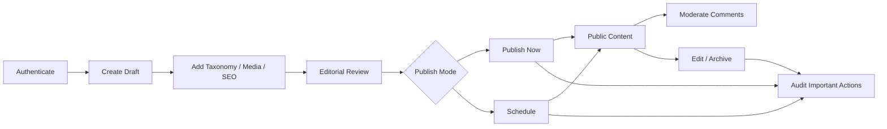

The most important business controls are:

- permission-based publishing;
- explicit content status;
- deterministic scheduled publication;
- public visibility tied to valid state;
- safe handling of media and taxonomy relations;
- moderated public comments;
- controlled administrative settings;
- auditability of important administrative changes.

These workflows intentionally avoid introducing billing, inventory, complex approval engines, or multi-tenant processes because those capabilities are outside ContentFlow CMS MVP.
