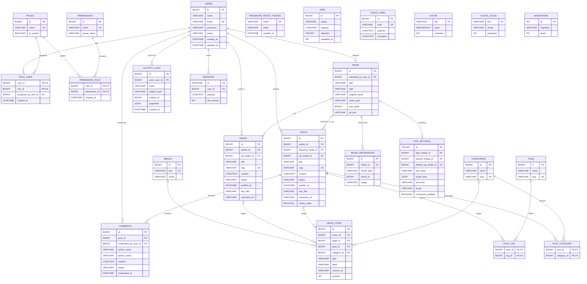

# Database Design
## ContentFlow CMS

---

## Document Control

| Field | Value |
|---|---|
| Document | Database Design |
| Product | ContentFlow CMS |
| Sources | `docs/PRD.md`, `docs/SRS.md`, `docs/SYSTEM_DESIGN.md`, `docs/BUSINESS_FLOW.md` |
| Database | MySQL 8.4.x LTS target |
| Application | Laravel modular monolith |
| Scope | MVP / Version 1.0 |
| Status | Design only — migrations not created |
| Last Updated | 2026-08-29 |

# 1. Database Design Principles

1. **Relational first.** Core CMS entities use normalized relational tables.
2. **MySQL is authoritative.** Cache, queue, and filesystem never replace business state.
3. **Laravel-native.** IDs, timestamps, FKs, pivots, sessions, queue, and cache fit Eloquent/Laravel conventions.
4. **Explicit fields for core behavior.** Status, publication time, author, slug, SEO fields, and permissions are typed columns rather than opaque JSON.
5. **JSON only where flexibility is real.** Initially `site_settings.social_links` and `activity_logs.properties`.
6. **No premature tenant/billing schema.** SaaS, subscriptions, payments, and quotas remain future scope.
7. **No EAV content model.** ContentFlow does not use a generic `entities/attributes/values` schema.
8. **Avoid unnecessary polymorphism.** Direct FKs are used for normal relations. Generic references are limited to audit subjects and non-first-class media usage.
9. **Lifecycle states replace soft deletion in MVP.** Posts use Archived, users use Inactive, comments use moderation states.
10. **Database constraints backstop application rules.** Business logic remains in Laravel Actions/Policies, while MySQL enforces keys, uniqueness, referential integrity, and valid status sets.
11. **Stable surrogate keys.** Business entities use unsigned BIGINT auto-increment IDs.
12. **UTF-8 full Unicode.** Use `utf8mb4`; choose one verified collation consistently during project initialization.

# 2. Entity List

## Business Tables
`users`, `roles`, `permissions`, `role_user`, `permission_role`, `posts`, `pages`, `categories`, `tags`, `post_category`, `post_tag`, `media`, `media_references`, `comments`, `menus`, `menu_items`, `site_settings`, `activity_logs`.

## Laravel Infrastructure Tables
`sessions`, `password_reset_tokens`, `jobs`, `failed_jobs`, `cache`, `cache_locks`, `migrations`.

## Explicitly Out of MVP
No `tenants`, `subscriptions`, `plans`, `payments`, `orders`, `inventory`, `webhooks`, API-token, revision, translation, approval-workflow, or analytics fact tables.

# 3. Table Description Summary

| Table | Domain | Main Responsibility |
|---|---|---|
| users | Identity | User account and active state |
| roles | Access | Role definitions |
| permissions | Access | Fine-grained capabilities |
| role_user | Access | User-role assignment |
| permission_role | Access | Role-permission assignment |
| posts | Content | Blog/article lifecycle |
| pages | Content | Static page lifecycle |
| categories | Taxonomy | Post categories |
| tags | Taxonomy | Post tags |
| post_category | Taxonomy | Post/category relationship |
| post_tag | Taxonomy | Post/tag relationship |
| media | Media | File metadata |
| media_references | Media | Generic embedded/reusable media usages |
| comments | Engagement | Public comments and moderation |
| menus | Navigation | Navigation containers |
| menu_items | Navigation | Ordered navigation targets |
| site_settings | Settings | Installation-wide typed settings |
| activity_logs | Audit | Business accountability events |
| sessions | Infrastructure | Database sessions |
| password_reset_tokens | Infrastructure | Password recovery |
| jobs | Infrastructure | Pending queued work |
| failed_jobs | Infrastructure | Failed queue work |
| cache | Infrastructure | Database cache |
| cache_locks | Infrastructure | Atomic locks |
| migrations | Infrastructure | Laravel schema history |

# 4. Column / Data Type Conventions

| Concept | Type |
|---|---|
| Business ID | `BIGINT UNSIGNED` |
| Singleton ID | `TINYINT UNSIGNED` |
| Email | `VARCHAR(254)` |
| Slug | `VARCHAR(255)` (category/tag may use 160) |
| Password hash | `VARCHAR(255)` |
| Status | `VARCHAR` + CHECK |
| Full URL | `VARCHAR(2048)` |
| Rich content | `LONGTEXT` |
| Flexible metadata | `JSON` |
| Boolean | `BOOLEAN` / MySQL `TINYINT(1)` |
| File size | `BIGINT UNSIGNED` |
| Image dimension/order | `INT UNSIGNED` |
| Domain timestamps | `DATETIME` |

Exact framework-generated infrastructure types must be verified against the installed Laravel version before migrations are written.

# 5. Primary Keys

- Business entities: `BIGINT UNSIGNED AUTO_INCREMENT`.
- Pure join tables: composite primary keys.
- `site_settings`: singleton `TINYINT UNSIGNED`, canonical `id=1`.
- Framework tables follow the verified Laravel-generated schema.

# 6. Foreign Keys

Use FKs for normal relationships. Prefer:
- `CASCADE` for pure pivot rows.
- `SET NULL` for optional attribution/media references where history may survive.
- `RESTRICT` for content authorship and destructive relationships where silent loss is unacceptable.

# 7. Unique Constraints

Required uniqueness:
- `users.email`
- `roles.name`
- `permissions.name`
- `posts.slug`
- `pages.slug`
- `categories.slug`
- `tags.slug`
- `menus.key`
- `media(disk,path)`
- `failed_jobs.uuid`
- composite pivot primary keys
- `media_references(media_id,owner_type,owner_id,usage)`

# 8. Nullable Rules

Required state and identifiers are NOT NULL. Optional SEO overrides, media references, excerpt, moderation metadata, contact settings, and image dimensions may be NULL. `posts.publish_at` may be NULL while Draft.

# 9. Default Values

| Field | Default |
|---|---|
| users.status | `active` |
| roles.is_system | `0` |
| posts.status | `draft` |
| posts.robots_index | `1` |
| pages.status | `draft` |
| pages.robots_index | `1` |
| comments.status | `pending` |
| menu_items.position | `0` |
| site_settings.default_robots_index | `1` |
| site_settings.comments_enabled | `1` |
| jobs.attempts | `0` |

`site_settings.timezone` and `locale` must be explicitly populated by the installer/configuration flow rather than relying on an implicit regional database default.

# 10. Index Strategy

Index only known access patterns:
- authentication by email;
- content status/author filters;
- scheduled publishing;
- pending comment moderation;
- menu ordering;
- activity browsing;
- session cleanup;
- queue polling.

Avoid indexing every text/metadata column.

# 11. Composite Indexes

Recommended:
- `posts(status, publish_at)`
- `posts(author_id, status)`
- `posts(status, created_at)`
- `comments(status, created_at)`
- `comments(post_id, status, created_at)`
- `media(uploaded_by_user_id, created_at)`
- `activity_logs(actor_user_id, created_at)`
- `activity_logs(subject_type, subject_id)`
- `activity_logs(event, created_at)`
- `menu_items(menu_id, position)`
- `sessions(last_activity)`

# 12. Referential Integrity

- Deactivating users does not alter authored content.
- Taxonomy pivots cascade when their parent relation is deliberately removed.
- Posts with comments use restrictive deletion by default.
- Referenced media must be checked before deletion.
- Direct media FKs cover featured/OG/branding assets; `media_references` covers additional usage.

# 13. Soft Delete Strategy

**No default soft deletes in MVP.**

Reasons:
- Posts already have Archived.
- Users already have Inactive.
- Comments already have moderation states.
- PRD does not define Trash/Restore.
- Soft-delete + unique slug behavior adds unnecessary complexity.

If a future Trash feature is approved, add `deleted_at` together with explicit restore, retention, permanent-delete, and slug-reuse rules.

# 14. Audit Timestamps

`created_at` + `updated_at` on mutable business entities.  
`activity_logs` is immutable and only needs `created_at`.  
`role_user` and `permission_role` keep assignment `created_at`.  
Pure taxonomy pivots do not need timestamps in MVP.

# 15. Status Fields

Use `VARCHAR` + CHECK, not MySQL ENUM.

- User: `active`, `inactive`
- Post: `draft`, `scheduled`, `published`, `archived`
- Page: `draft`, `published`, `archived`
- Comment: `pending`, `approved`, `spam`, `rejected`

Future-time scheduling is an application transition rule; the database ensures status vocabulary and structural integrity.

# 16. Money / Decimal Handling

MVP has no monetary data because billing, subscriptions, e-commerce, payments, and paid membership are out of scope.

Future rule: use `DECIMAL`, never FLOAT/DOUBLE for currency, and store a separate 3-character currency code.

# 17. File Reference Handling

Files are stored through Laravel Filesystem; MySQL stores metadata only.

First-class direct FKs:
- `posts.featured_media_id`
- `posts.og_media_id`
- `pages.og_media_id`
- `site_settings.logo_media_id`
- `site_settings.favicon_media_id`
- `site_settings.default_og_media_id`

`media_references` is reserved for generic usage such as rich-content embedded media. Business logic must query both direct references and generic references before deleting a media file.

# 18. Settings Architecture

Use one typed `site_settings` singleton row rather than a generic EAV `settings(key,value)` table.

Benefits:
- typed data;
- actual media FKs;
- predictable defaults;
- simpler validation;
- easier documentation.

Only naturally flexible configuration such as social links uses JSON.

# 19. Activity Logging

`activity_logs` records operational accountability events such as:
`USER_CREATED`, `USER_DEACTIVATED`, `USER_REACTIVATED`, `ROLE_ASSIGNED`, `ROLE_PERMISSION_CHANGED`, `POST_PUBLISHED`, `POST_ARCHIVED`, optional `POST_SCHEDULED`, optional `COMMENT_MODERATED`, `SETTINGS_UPDATED`, and optional `MEDIA_DELETED`.

Never store passwords, session values, SMTP credentials, or application secrets in `properties`.

# 20. Transaction Boundaries

Use database transactions where partial success would invalidate business state:

1. User creation + role assignment.
2. Role/permission mapping changes.
3. Publish post + required audit record.
4. Schedule post + related state/audit changes.
5. Comment moderation + moderator metadata/audit.
6. Site settings update + audit.
7. Multi-item menu reorder/save.

Cache invalidation and non-critical external side effects occur after commit. Do not keep DB transactions open while waiting for SMTP or future webhooks.

# 21. Complete Mermaid ERD



# Detailed Table Specifications

## 1. `users`

### Purpose

Stores administrative/editorial user identities and Active/Inactive account state.

### Columns

| Column | Type | Null | Default | Notes |
|---|---|:---:|---|---|
| `id` | `BIGINT UNSIGNED` | NO | `AUTO_INCREMENT` | Primary key |
| `name` | `VARCHAR(150)` | NO | `—` | User display/name |
| `email` | `VARCHAR(254)` | NO | `—` | Unique login identifier |
| `password` | `VARCHAR(255)` | NO | `—` | Password hash only |
| `status` | `VARCHAR(20)` | NO | `active` | active / inactive |
| `created_at` | `DATETIME` | NO | `framework-managed` | Created timestamp |
| `updated_at` | `DATETIME` | NO | `framework-managed` | Updated timestamp |

### Relationships

- 1:N posts as author
- 1:N pages as author
- M:N roles through role_user
- 1:N media uploads
- 1:N moderated comments
- 1:N activity_logs
- 1:N sessions

### Indexes

- `PRIMARY KEY (id)`
- `UNIQUE (email)`
- `INDEX (status)`

### Constraints / Integrity Rules

- CHECK status IN ('active','inactive')
- Prefer Inactive over physical deletion
- At least one active Super Admin must remain by application rule

## 2. `roles`

### Purpose

Groups stable permissions into roles such as Super Admin, Administrator, Editor, and Author.

### Columns

| Column | Type | Null | Default | Notes |
|---|---|:---:|---|---|
| `id` | `BIGINT UNSIGNED` | NO | `AUTO_INCREMENT` | Primary key |
| `name` | `VARCHAR(80)` | NO | `—` | Unique role name |
| `description` | `VARCHAR(255)` | YES | `NULL` | Human-readable purpose |
| `is_system` | `BOOLEAN` | NO | `0` | Marks seeded/system role |
| `created_at` | `DATETIME` | NO | `framework-managed` |  |
| `updated_at` | `DATETIME` | NO | `framework-managed` |  |

### Relationships

- M:N users
- M:N permissions

### Indexes

- `PRIMARY KEY (id)`
- `UNIQUE (name)`

### Constraints / Integrity Rules

- Default roles are seed data, not database ENUM values

## 3. `permissions`

### Purpose

Stores action-oriented capabilities enforced by Laravel Policies/Gates.

### Columns

| Column | Type | Null | Default | Notes |
|---|---|:---:|---|---|
| `id` | `BIGINT UNSIGNED` | NO | `AUTO_INCREMENT` | Primary key |
| `name` | `VARCHAR(120)` | NO | `—` | Stable key such as posts.publish |
| `group_name` | `VARCHAR(80)` | YES | `NULL` | Admin grouping |
| `description` | `VARCHAR(255)` | YES | `NULL` | Description |
| `created_at` | `DATETIME` | NO | `framework-managed` |  |
| `updated_at` | `DATETIME` | NO | `framework-managed` |  |

### Relationships

- M:N roles

### Indexes

- `PRIMARY KEY (id)`
- `UNIQUE (name)`
- `INDEX (group_name)`

### Constraints / Integrity Rules

- Permission name is a stable application contract

## 4. `role_user`

### Purpose

Assigns one or more roles to a user and records who performed the assignment.

### Columns

| Column | Type | Null | Default | Notes |
|---|---|:---:|---|---|
| `user_id` | `BIGINT UNSIGNED` | NO | `—` | PK/FK users |
| `role_id` | `BIGINT UNSIGNED` | NO | `—` | PK/FK roles |
| `assigned_by_user_id` | `BIGINT UNSIGNED` | YES | `NULL` | FK user who assigned |
| `created_at` | `DATETIME` | NO | `framework-managed` | Assignment time |

### Relationships

- Belongs to user
- Belongs to role
- Optional assigning user

### Indexes

- `PRIMARY KEY (user_id, role_id)`
- `INDEX (role_id)`
- `INDEX (assigned_by_user_id)`

### Constraints / Integrity Rules

- user_id → users.id ON DELETE CASCADE
- role_id → roles.id ON DELETE CASCADE
- assigned_by_user_id → users.id ON DELETE SET NULL

## 5. `permission_role`

### Purpose

Maps permissions to roles.

### Columns

| Column | Type | Null | Default | Notes |
|---|---|:---:|---|---|
| `role_id` | `BIGINT UNSIGNED` | NO | `—` | PK/FK roles |
| `permission_id` | `BIGINT UNSIGNED` | NO | `—` | PK/FK permissions |
| `created_at` | `DATETIME` | NO | `framework-managed` | Assignment time |

### Relationships

- Belongs to role
- Belongs to permission

### Indexes

- `PRIMARY KEY (role_id, permission_id)`
- `INDEX (permission_id)`

### Constraints / Integrity Rules

- role_id → roles.id ON DELETE CASCADE
- permission_id → permissions.id ON DELETE CASCADE

## 6. `posts`

### Purpose

Stores article/blog content and the Draft/Scheduled/Published/Archived editorial lifecycle.

### Columns

| Column | Type | Null | Default | Notes |
|---|---|:---:|---|---|
| `id` | `BIGINT UNSIGNED` | NO | `AUTO_INCREMENT` | Primary key |
| `author_id` | `BIGINT UNSIGNED` | NO | `—` | FK users |
| `featured_media_id` | `BIGINT UNSIGNED` | YES | `NULL` | FK media |
| `og_media_id` | `BIGINT UNSIGNED` | YES | `NULL` | Open Graph image |
| `title` | `VARCHAR(255)` | NO | `—` | Post title |
| `slug` | `VARCHAR(255)` | NO | `—` | Unique public slug |
| `excerpt` | `TEXT` | YES | `NULL` | Optional summary |
| `content` | `LONGTEXT` | NO | `—` | Rich article body |
| `status` | `VARCHAR(20)` | NO | `draft` | draft/scheduled/published/archived |
| `publish_at` | `DATETIME` | YES | `NULL` | Scheduled or effective publication time |
| `seo_title` | `VARCHAR(255)` | YES | `NULL` | SEO override |
| `meta_description` | `VARCHAR(320)` | YES | `NULL` | SEO override |
| `canonical_url` | `VARCHAR(2048)` | YES | `NULL` | Optional canonical URL |
| `robots_index` | `BOOLEAN` | NO | `1` | Index/noindex flag |
| `created_at` | `DATETIME` | NO | `framework-managed` |  |
| `updated_at` | `DATETIME` | NO | `framework-managed` |  |

### Relationships

- Belongs to author
- Optional featured media
- Optional OG media
- M:N categories
- M:N tags
- 1:N comments
- May be menu target
- May have media_references

### Indexes

- `PRIMARY KEY (id)`
- `UNIQUE (slug)`
- `INDEX (status, publish_at)`
- `INDEX (author_id, status)`
- `INDEX (status, created_at)`
- `INDEX (featured_media_id)`
- `INDEX (og_media_id)`

### Constraints / Integrity Rules

- author_id → users.id ON DELETE RESTRICT
- featured_media_id → media.id ON DELETE SET NULL
- og_media_id → media.id ON DELETE SET NULL
- CHECK status IN ('draft','scheduled','published','archived')
- Scheduled future-time validity enforced by business logic

## 7. `pages`

### Purpose

Stores static site pages such as About, Contact, Privacy Policy, and Company Profile.

### Columns

| Column | Type | Null | Default | Notes |
|---|---|:---:|---|---|
| `id` | `BIGINT UNSIGNED` | NO | `AUTO_INCREMENT` | Primary key |
| `author_id` | `BIGINT UNSIGNED` | NO | `—` | FK users |
| `og_media_id` | `BIGINT UNSIGNED` | YES | `NULL` | Open Graph image |
| `title` | `VARCHAR(255)` | NO | `—` | Page title |
| `slug` | `VARCHAR(255)` | NO | `—` | Unique public slug |
| `content` | `LONGTEXT` | NO | `—` | Page body |
| `status` | `VARCHAR(20)` | NO | `draft` | draft/published/archived |
| `publish_at` | `DATETIME` | YES | `NULL` | Effective publish time |
| `seo_title` | `VARCHAR(255)` | YES | `NULL` | SEO override |
| `meta_description` | `VARCHAR(320)` | YES | `NULL` | SEO override |
| `canonical_url` | `VARCHAR(2048)` | YES | `NULL` | Canonical URL |
| `robots_index` | `BOOLEAN` | NO | `1` | Index/noindex flag |
| `created_at` | `DATETIME` | NO | `framework-managed` |  |
| `updated_at` | `DATETIME` | NO | `framework-managed` |  |

### Relationships

- Belongs to author
- Optional OG media
- May be menu target

### Indexes

- `PRIMARY KEY (id)`
- `UNIQUE (slug)`
- `INDEX (status, created_at)`
- `INDEX (author_id, status)`
- `INDEX (og_media_id)`

### Constraints / Integrity Rules

- author_id → users.id ON DELETE RESTRICT
- og_media_id → media.id ON DELETE SET NULL
- CHECK status IN ('draft','published','archived')
- Page scheduling is not part of MVP

## 8. `categories`

### Purpose

Stores post categories used for classification and public/category navigation.

### Columns

| Column | Type | Null | Default | Notes |
|---|---|:---:|---|---|
| `id` | `BIGINT UNSIGNED` | NO | `AUTO_INCREMENT` | Primary key |
| `name` | `VARCHAR(120)` | NO | `—` | Category name |
| `slug` | `VARCHAR(160)` | NO | `—` | Unique slug |
| `description` | `TEXT` | YES | `NULL` | Optional description |
| `created_at` | `DATETIME` | NO | `framework-managed` |  |
| `updated_at` | `DATETIME` | NO | `framework-managed` |  |

### Relationships

- M:N posts
- May be menu target

### Indexes

- `PRIMARY KEY (id)`
- `UNIQUE (slug)`
- `INDEX (name)`

### Constraints / Integrity Rules

- Flat category model in MVP; add parent_id only when hierarchy becomes approved scope

## 9. `tags`

### Purpose

Stores flat post tags.

### Columns

| Column | Type | Null | Default | Notes |
|---|---|:---:|---|---|
| `id` | `BIGINT UNSIGNED` | NO | `AUTO_INCREMENT` | Primary key |
| `name` | `VARCHAR(120)` | NO | `—` | Tag name |
| `slug` | `VARCHAR(160)` | NO | `—` | Unique slug |
| `created_at` | `DATETIME` | NO | `framework-managed` |  |
| `updated_at` | `DATETIME` | NO | `framework-managed` |  |

### Relationships

- M:N posts

### Indexes

- `PRIMARY KEY (id)`
- `UNIQUE (slug)`
- `INDEX (name)`

### Constraints / Integrity Rules

- Flat taxonomy in MVP

## 10. `post_category`

### Purpose

Many-to-many post/category membership.

### Columns

| Column | Type | Null | Default | Notes |
|---|---|:---:|---|---|
| `post_id` | `BIGINT UNSIGNED` | NO | `—` | PK/FK posts |
| `category_id` | `BIGINT UNSIGNED` | NO | `—` | PK/FK categories |

### Relationships

- Belongs to post
- Belongs to category

### Indexes

- `PRIMARY KEY (post_id, category_id)`
- `INDEX (category_id, post_id)`

### Constraints / Integrity Rules

- post_id → posts.id ON DELETE CASCADE
- category_id → categories.id ON DELETE CASCADE

## 11. `post_tag`

### Purpose

Many-to-many post/tag membership.

### Columns

| Column | Type | Null | Default | Notes |
|---|---|:---:|---|---|
| `post_id` | `BIGINT UNSIGNED` | NO | `—` | PK/FK posts |
| `tag_id` | `BIGINT UNSIGNED` | NO | `—` | PK/FK tags |

### Relationships

- Belongs to post
- Belongs to tag

### Indexes

- `PRIMARY KEY (post_id, tag_id)`
- `INDEX (tag_id, post_id)`

### Constraints / Integrity Rules

- post_id → posts.id ON DELETE CASCADE
- tag_id → tags.id ON DELETE CASCADE

## 12. `media`

### Purpose

Stores Media Library metadata. Binary files remain in Laravel Filesystem, not MySQL.

### Columns

| Column | Type | Null | Default | Notes |
|---|---|:---:|---|---|
| `id` | `BIGINT UNSIGNED` | NO | `AUTO_INCREMENT` | Primary key |
| `uploaded_by_user_id` | `BIGINT UNSIGNED` | YES | `NULL` | Uploader FK |
| `disk` | `VARCHAR(64)` | NO | `—` | Laravel logical disk |
| `path` | `VARCHAR(1024)` | NO | `—` | Storage-relative path |
| `original_name` | `VARCHAR(255)` | NO | `—` | Original upload name |
| `file_name` | `VARCHAR(255)` | NO | `—` | Stored/current basename |
| `mime_type` | `VARCHAR(127)` | NO | `—` | Validated MIME |
| `size_bytes` | `BIGINT UNSIGNED` | NO | `—` | File size |
| `width` | `INT UNSIGNED` | YES | `NULL` | Image width |
| `height` | `INT UNSIGNED` | YES | `NULL` | Image height |
| `alt_text` | `VARCHAR(500)` | YES | `NULL` | Image accessibility/SEO |
| `created_at` | `DATETIME` | NO | `framework-managed` |  |
| `updated_at` | `DATETIME` | NO | `framework-managed` |  |

### Relationships

- Optional uploader user
- 1:N media_references
- Referenced by posts/pages/site_settings

### Indexes

- `PRIMARY KEY (id)`
- `UNIQUE (disk, path)`
- `INDEX (uploaded_by_user_id, created_at)`
- `INDEX (original_name)`

### Constraints / Integrity Rules

- uploaded_by_user_id → users.id ON DELETE SET NULL
- Application validates allowlisted type and size
- Binary payload is not stored in DB

## 13. `media_references`

### Purpose

Tracks generic media usage that is not represented by a dedicated first-class FK, especially rich-content embedded media.

### Columns

| Column | Type | Null | Default | Notes |
|---|---|:---:|---|---|
| `id` | `BIGINT UNSIGNED` | NO | `AUTO_INCREMENT` | Primary key |
| `media_id` | `BIGINT UNSIGNED` | NO | `—` | FK media |
| `owner_type` | `VARCHAR(80)` | NO | `—` | Controlled application type |
| `owner_id` | `BIGINT UNSIGNED` | NO | `—` | Logical owner ID |
| `usage` | `VARCHAR(80)` | NO | `—` | e.g. content_embed |
| `created_at` | `DATETIME` | NO | `framework-managed` |  |

### Relationships

- Belongs to media
- Logical polymorphic owner

### Indexes

- `PRIMARY KEY (id)`
- `UNIQUE (media_id, owner_type, owner_id, usage)`
- `INDEX (owner_type, owner_id)`
- `INDEX (media_id)`

### Constraints / Integrity Rules

- media_id → media.id ON DELETE CASCADE
- owner_type and usage are controlled values, not arbitrary public input

## 14. `comments`

### Purpose

Stores public comments and moderation state.

### Columns

| Column | Type | Null | Default | Notes |
|---|---|:---:|---|---|
| `id` | `BIGINT UNSIGNED` | NO | `AUTO_INCREMENT` | Primary key |
| `post_id` | `BIGINT UNSIGNED` | NO | `—` | FK post |
| `moderated_by_user_id` | `BIGINT UNSIGNED` | YES | `NULL` | Moderator FK |
| `author_name` | `VARCHAR(150)` | NO | `—` | Visitor name |
| `author_email` | `VARCHAR(254)` | NO | `—` | Visitor email |
| `content` | `LONGTEXT` | NO | `—` | Comment body |
| `status` | `VARCHAR(20)` | NO | `pending` | pending/approved/spam/rejected |
| `moderated_at` | `DATETIME` | YES | `NULL` | Last moderation time |
| `created_at` | `DATETIME` | NO | `framework-managed` |  |
| `updated_at` | `DATETIME` | NO | `framework-managed` |  |

### Relationships

- Belongs to post
- Optional moderator user

### Indexes

- `PRIMARY KEY (id)`
- `INDEX (status, created_at)`
- `INDEX (post_id, status, created_at)`
- `INDEX (moderated_by_user_id)`

### Constraints / Integrity Rules

- post_id → posts.id ON DELETE RESTRICT
- moderated_by_user_id → users.id ON DELETE SET NULL
- CHECK status IN ('pending','approved','spam','rejected')
- Only approved is public

## 15. `menus`

### Purpose

Defines named navigation menus such as header or footer.

### Columns

| Column | Type | Null | Default | Notes |
|---|---|:---:|---|---|
| `id` | `BIGINT UNSIGNED` | NO | `AUTO_INCREMENT` | Primary key |
| `key` | `VARCHAR(80)` | NO | `—` | Stable machine key/location |
| `name` | `VARCHAR(120)` | NO | `—` | Admin display name |
| `created_at` | `DATETIME` | NO | `framework-managed` |  |
| `updated_at` | `DATETIME` | NO | `framework-managed` |  |

### Relationships

- 1:N menu_items

### Indexes

- `PRIMARY KEY (id)`
- `UNIQUE (`key`)`

### Constraints / Integrity Rules

- Menu key is stable and unique

## 16. `menu_items`

### Purpose

Stores ordered menu entries targeting a Page, Post, Category, or custom URL.

### Columns

| Column | Type | Null | Default | Notes |
|---|---|:---:|---|---|
| `id` | `BIGINT UNSIGNED` | NO | `AUTO_INCREMENT` | Primary key |
| `menu_id` | `BIGINT UNSIGNED` | NO | `—` | FK menus |
| `type` | `VARCHAR(20)` | NO | `—` | page/post/category/custom |
| `label` | `VARCHAR(150)` | NO | `—` | Visible label |
| `page_id` | `BIGINT UNSIGNED` | YES | `NULL` | Page target |
| `post_id` | `BIGINT UNSIGNED` | YES | `NULL` | Post target |
| `category_id` | `BIGINT UNSIGNED` | YES | `NULL` | Category target |
| `custom_url` | `VARCHAR(2048)` | YES | `NULL` | Custom URL target |
| `position` | `INT UNSIGNED` | NO | `0` | Ordering |
| `created_at` | `DATETIME` | NO | `framework-managed` |  |
| `updated_at` | `DATETIME` | NO | `framework-managed` |  |

### Relationships

- Belongs to menu
- Optional target Page/Post/Category

### Indexes

- `PRIMARY KEY (id)`
- `INDEX (menu_id, position)`
- `INDEX (page_id)`
- `INDEX (post_id)`
- `INDEX (category_id)`

### Constraints / Integrity Rules

- menu_id → menus.id ON DELETE CASCADE
- page_id/post_id/category_id → target ON DELETE SET NULL
- CHECK type IN ('page','post','category','custom')
- Exactly one destination must match type
- Nested menus are not modeled in MVP

## 17. `site_settings`

### Purpose

Stores installation-wide typed settings in a single row; avoids an EAV settings table.

### Columns

| Column | Type | Null | Default | Notes |
|---|---|:---:|---|---|
| `id` | `TINYINT UNSIGNED` | NO | `1` | Singleton PK |
| `site_name` | `VARCHAR(150)` | NO | `—` | Site identity |
| `site_description` | `VARCHAR(320)` | YES | `NULL` | Description |
| `logo_media_id` | `BIGINT UNSIGNED` | YES | `NULL` | Logo media |
| `favicon_media_id` | `BIGINT UNSIGNED` | YES | `NULL` | Favicon media |
| `contact_email` | `VARCHAR(254)` | YES | `NULL` | Contact email |
| `contact_phone` | `VARCHAR(50)` | YES | `NULL` | Contact phone |
| `contact_address` | `TEXT` | YES | `NULL` | Contact address |
| `social_links` | `JSON` | YES | `NULL` | Flexible provider→URL map |
| `default_seo_title` | `VARCHAR(255)` | YES | `NULL` | Global SEO title |
| `default_meta_description` | `VARCHAR(320)` | YES | `NULL` | Global meta description |
| `default_og_media_id` | `BIGINT UNSIGNED` | YES | `NULL` | Global OG media |
| `default_robots_index` | `BOOLEAN` | NO | `1` | Default index state |
| `timezone` | `VARCHAR(64)` | NO | `installer value` | Site/app timezone |
| `locale` | `VARCHAR(16)` | NO | `installer value` | Configured locale |
| `comments_enabled` | `BOOLEAN` | NO | `1` | Global comments switch |
| `created_at` | `DATETIME` | NO | `framework-managed` |  |
| `updated_at` | `DATETIME` | NO | `framework-managed` |  |

### Relationships

- Optional logo/favicon/default OG media

### Indexes

- `PRIMARY KEY (id)`

### Constraints / Integrity Rules

- One row per installation; canonical id=1
- Media FKs ON DELETE SET NULL
- No arbitrary secrets stored here

## 18. `activity_logs`

### Purpose

Stores business/accountability events separately from technical application logs.

### Columns

| Column | Type | Null | Default | Notes |
|---|---|:---:|---|---|
| `id` | `BIGINT UNSIGNED` | NO | `AUTO_INCREMENT` | Primary key |
| `actor_user_id` | `BIGINT UNSIGNED` | YES | `NULL` | Human actor; NULL for system |
| `event` | `VARCHAR(80)` | NO | `—` | Stable event key |
| `subject_type` | `VARCHAR(80)` | YES | `NULL` | Controlled domain type |
| `subject_id` | `BIGINT UNSIGNED` | YES | `NULL` | Logical subject ID |
| `properties` | `JSON` | YES | `NULL` | Safe metadata/diff |
| `created_at` | `DATETIME` | NO | `framework-managed` | Immutable event time |

### Relationships

- Optional actor user
- Logical polymorphic subject

### Indexes

- `PRIMARY KEY (id)`
- `INDEX (actor_user_id, created_at)`
- `INDEX (subject_type, subject_id)`
- `INDEX (event, created_at)`
- `INDEX (created_at)`

### Constraints / Integrity Rules

- actor_user_id → users.id ON DELETE SET NULL
- No updated_at
- Normal product behavior does not edit rows
- properties must not contain secrets

## 19. `sessions`

### Purpose

Laravel database-backed authenticated sessions.

### Columns

| Column | Type | Null | Default | Notes |
|---|---|:---:|---|---|
| `id` | `VARCHAR(255)` | NO | `—` | Primary key |
| `user_id` | `BIGINT UNSIGNED` | YES | `NULL` | Optional user |
| `ip_address` | `VARCHAR(45)` | YES | `NULL` | IPv4/IPv6 |
| `user_agent` | `TEXT` | YES | `NULL` | Client metadata |
| `payload` | `LONGTEXT` | NO | `—` | Framework session payload |
| `last_activity` | `INT` | NO | `—` | Unix timestamp |

### Relationships

- Optional user

### Indexes

- `PRIMARY KEY (id)`
- `INDEX (user_id)`
- `INDEX (last_activity)`

### Constraints / Integrity Rules

- Exact Laravel-generated schema must be verified from installed version

## 20. `password_reset_tokens`

### Purpose

Laravel-native password reset tokens.

### Columns

| Column | Type | Null | Default | Notes |
|---|---|:---:|---|---|
| `email` | `VARCHAR(254/255)` | NO | `—` | Primary key |
| `token` | `VARCHAR(255)` | NO | `—` | Reset token hash/value per framework |
| `created_at` | `DATETIME` | YES | `NULL` | Issued time |

### Relationships

- No direct business relationship.

### Indexes

- `PRIMARY KEY (email)`

### Constraints / Integrity Rules

- Expiry enforced by auth configuration
- Exact framework schema verified after project initialization

## 21. `jobs`

### Purpose

Laravel database queue pending jobs.

### Columns

| Column | Type | Null | Default | Notes |
|---|---|:---:|---|---|
| `id` | `BIGINT UNSIGNED` | NO | `AUTO_INCREMENT` | Primary key |
| `queue` | `VARCHAR(255)` | NO | `—` | Queue name |
| `payload` | `LONGTEXT` | NO | `—` | Serialized job payload |
| `attempts` | `TINYINT UNSIGNED` | NO | `0` | Attempts |
| `reserved_at` | `INT UNSIGNED` | YES | `NULL` | Reservation time |
| `available_at` | `INT UNSIGNED` | NO | `—` | Availability time |
| `created_at` | `INT UNSIGNED` | NO | `—` | Creation time |

### Relationships

- No direct business relationship.

### Indexes

- `PRIMARY KEY (id)`
- `INDEX (queue)`

### Constraints / Integrity Rules

- Final schema follows verified Laravel 13.x generated migration

## 22. `failed_jobs`

### Purpose

Stores terminally failed queue jobs for operations/debugging.

### Columns

| Column | Type | Null | Default | Notes |
|---|---|:---:|---|---|
| `id` | `BIGINT UNSIGNED` | NO | `AUTO_INCREMENT` | Primary key |
| `uuid` | `VARCHAR(255)` | NO | `—` | Unique job UUID |
| `connection` | `TEXT` | NO | `—` | Connection |
| `queue` | `TEXT` | NO | `—` | Queue |
| `payload` | `LONGTEXT` | NO | `—` | Payload |
| `exception` | `LONGTEXT` | NO | `—` | Failure details |
| `failed_at` | `DATETIME/TIMESTAMP` | NO | `current timestamp` | Failure time |

### Relationships

- No direct business relationship.

### Indexes

- `PRIMARY KEY (id)`
- `UNIQUE (uuid)`

### Constraints / Integrity Rules

- Access restricted; operational payload may contain application context

## 23. `cache`

### Purpose

Laravel database cache store.

### Columns

| Column | Type | Null | Default | Notes |
|---|---|:---:|---|---|
| `key` | `VARCHAR(255)` | NO | `—` | Primary key |
| `value` | `MEDIUMTEXT` | NO | `—` | Cached value |
| `expiration` | `INT` | NO | `—` | Expiry |

### Relationships

- No direct business relationship.

### Indexes

- `PRIMARY KEY (`key`)`

### Constraints / Integrity Rules

- Disposable; never authoritative

## 24. `cache_locks`

### Purpose

Laravel database atomic locks.

### Columns

| Column | Type | Null | Default | Notes |
|---|---|:---:|---|---|
| `key` | `VARCHAR(255)` | NO | `—` | Primary key |
| `owner` | `VARCHAR(255)` | NO | `—` | Lock owner |
| `expiration` | `INT` | NO | `—` | Expiry |

### Relationships

- No direct business relationship.

### Indexes

- `PRIMARY KEY (`key`)`

### Constraints / Integrity Rules

- Operational only

## 25. `migrations`

### Purpose

Tracks Laravel schema migration execution.

### Columns

| Column | Type | Null | Default | Notes |
|---|---|:---:|---|---|
| `id` | `INT UNSIGNED` | NO | `AUTO_INCREMENT` | Primary key |
| `migration` | `VARCHAR(255)` | NO | `—` | Migration name |
| `batch` | `INT` | NO | `—` | Migration batch |

### Relationships

- No direct business relationship.

### Indexes

- `PRIMARY KEY (id)`

### Constraints / Integrity Rules

- Managed by Laravel migration tooling

# 22. Database State Transition Rules

## Posts

| From | To | Required Database State |
|---|---|---|
| Draft | Scheduled | `status=scheduled`, valid non-null `publish_at` |
| Draft | Published | `status=published`, `publish_at` = effective publication time |
| Scheduled | Draft | `status=draft`, recommended `publish_at=NULL` |
| Scheduled | Published | scheduler marks due post `published` |
| Published | Archived | `status=archived` |
| Published | Draft | only if permitted by product workflow; clear/normalize publication state |
| Archived | Draft | `status=draft`, `publish_at=NULL` |

No direct Archived → Published in MVP.

## Comments

New comment:
- `status=pending`
- `moderated_by_user_id=NULL`
- `moderated_at=NULL`

Moderation:
- status becomes `approved`, `spam`, or `rejected`
- moderator FK and `moderated_at` are updated

Only Approved comments are publicly visible.

## Users

- Active → Inactive changes only account status.
- Inactive → Active re-enables authentication eligibility.
- Authored content is preserved.

# 23. Data Retention

- Content is not auto-deleted.
- User deactivation preserves authorship.
- Referenced media is retained until references are resolved.
- Audit retention is deployment policy, not a separate schema in MVP.
- Session/cache/queue maintenance uses Laravel-supported pruning/cleanup.

# 24. Search and Reporting Support

The schema directly supports:
- post title/status/author/category filters;
- scheduled publishing by `(status,publish_at)`;
- dashboard content counts;
- pending comments;
- approved comments per post;
- recent content;
- activity-log filtering.

No external search engine or analytics warehouse is required.

# 25. Security-Oriented Database Rules

1. Password hashes only.
2. No application secrets in `site_settings`.
3. Comment email is private application data and should not be rendered publicly by default.
4. MySQL is not exposed publicly without a protected operational requirement.
5. Application DB credentials follow least privilege.
6. Audit metadata excludes secrets.
7. Uploaded binary data is outside MySQL.
8. Use Eloquent/query builder parameter binding for normal application access.
9. Backups require access control.

# 26. Future Expansion Without Overengineering

Do **not** pre-create speculative tables.

Possible future additions only when their requirements are approved:

- `content_revisions`
- `post_translations` / `page_translations`
- tenant/site ownership tables
- subscription/billing tables
- API tokens
- webhook subscriptions/deliveries
- custom-field/content-block tables

Do not add `tenant_id` to every table before the SaaS isolation model is designed.

# 27. Database Trade-Offs

## Separate Posts and Pages
Chosen because Posts have scheduling, taxonomy, and comments while Pages have a simpler lifecycle. This avoids a generic `contents` table with many nullable/type-dependent fields.

## SEO Embedded in Posts/Pages
Chosen because SEO is one-to-one with these content entities in MVP. A generic SEO polymorphic table would add complexity without current value.

## Typed Site Settings
Chosen over EAV. New core settings may require a migration, which is acceptable because Laravel migrations are the schema-evolution mechanism.

## No Soft Deletes
Chosen because explicit statuses already model lifecycle and the product has no Trash feature.

## Many-to-Many Categories
Retained because `SYSTEM_DESIGN.md` models Posts ↔ Categories as many-to-many and it adds little complexity.

# 28. Pre-Migration Review Checklist

Before writing migrations:

- [ ] verify actual Laravel version
- [ ] verify PHP version
- [ ] verify MySQL version
- [ ] inspect Laravel-generated session/cache/queue/reset-token schemas
- [ ] choose final `utf8mb4` collation
- [ ] finalize timezone storage policy
- [ ] finalize role/permission seed list
- [ ] confirm Post and Page URL namespaces
- [ ] confirm upload MIME/size policy
- [ ] confirm installer-required site settings
- [ ] confirm comments default enablement
- [ ] confirm mandatory vs optional audit events
- [ ] confirm Category remains flat in MVP
- [ ] validate MySQL CHECK constraints for `menu_items`
- [ ] document backup/restore process

No migration should silently resolve an unsettled product rule.

# 29. Final Database Architecture

```text
Identity / RBAC
├── users
├── roles
├── permissions
├── role_user
└── permission_role

Content
├── posts
├── pages
├── categories
├── tags
├── post_category
└── post_tag

Media
├── media
└── media_references

Engagement
└── comments

Navigation
├── menus
└── menu_items

Settings
└── site_settings

Audit
└── activity_logs

Laravel Infrastructure
├── sessions
├── password_reset_tokens
├── jobs
├── failed_jobs
├── cache
├── cache_locks
└── migrations
```

This schema is intentionally sufficient for the ContentFlow CMS MVP while leaving future capabilities to explicit future migrations rather than speculative database abstraction.
