# System Design
## ContentFlow CMS

---

## Document Control

| Field | Value |
|---|---|
| Document | System Design |
| Product | ContentFlow CMS |
| Product Requirements Source | `docs/PRD.md` |
| Software Requirements Source | `docs/SRS.md` |
| Architecture Style | Modular Monolith |
| Primary Deployment | Linux VPS |
| Target Release | MVP / Version 1.0 |
| Document Status | Draft for Engineering |
| Last Updated | 2026-08-29 |

### Source Authority

This document is derived from:

1. `docs/PRD.md` — authoritative for product behavior, business scope, roles, user journeys, business rules, MVP boundaries, and acceptance criteria.
2. `docs/SRS.md` — authoritative for the current technical requirements and architectural constraints.

Where this document introduces a design choice not explicitly dictated by the source documents, the choice is intentionally conservative and follows Laravel conventions.

### Environment Status

The project runtime has not yet been initialized or exposed in the current workspace. Therefore installed framework/runtime versions remain:

**TBD — Requires Environment Verification**

Target stack inherited from `docs/SRS.md`:

- Laravel 13.x target
- PHP 8.4.x target
- MySQL 8.4.x LTS target
- Blade
- Livewire
- Tailwind CSS
- Alpine.js
- Linux VPS
- Nginx recommended
- Laravel database queue for MVP
- Laravel Scheduler
- Laravel filesystem abstraction
- Database-backed sessions recommended
- Database/file cache; database cache preferred for shared state

The exact versions must be verified from the real project files after initialization.

---

# 1. Architecture Overview

ContentFlow CMS shall use a **Laravel modular monolith**.

The product is one deployable Laravel application with clear logical module boundaries. The architecture avoids microservices, distributed messaging, external search infrastructure, and mandatory Redis because the MVP does not require them.

The system exposes two primary application surfaces:

1. **Public Website**
   - published posts;
   - published pages;
   - navigation;
   - categories/tags;
   - approved comments;
   - SEO metadata.

2. **Administration Dashboard**
   - content management;
   - media;
   - comments;
   - users;
   - roles/permissions;
   - menus;
   - SEO;
   - settings;
   - dashboard/reporting;
   - audit trail.

### 1.1 Core Architecture Principle

```text
UI coordinates.
Actions execute use cases.
Models preserve domain state.
Policies enforce permissions.
Eloquent persists data.
Events decouple real side effects.
Queues move non-blocking work out of HTTP requests.
```

### 1.2 Architecture Goals

The design optimizes for:

1. simplicity;
2. correctness;
3. security;
4. maintainability;
5. testability;
6. commercial reusability;
7. upgradeability;
8. measured scalability.

### 1.3 Deployment Unit

For MVP:

```text
1 Laravel Application
1 MySQL Database
1 Public File Storage Location
1 Queue Worker
1 Laravel Scheduler Invocation
1 SMTP-Compatible Mail Provider
```

These may run on the same VPS initially.

### 1.4 Non-Goals

The architecture shall not introduce:

- microservices;
- service mesh;
- event streaming platform;
- separate API backend;
- headless-only architecture;
- Redis as a required dependency;
- Elasticsearch/Meilisearch as a required dependency;
- Kubernetes;
- multi-tenant data isolation;
- plugin marketplace runtime;
- generic repository layer around every Eloquent model.

---

# 2. System Context Diagram using Mermaid

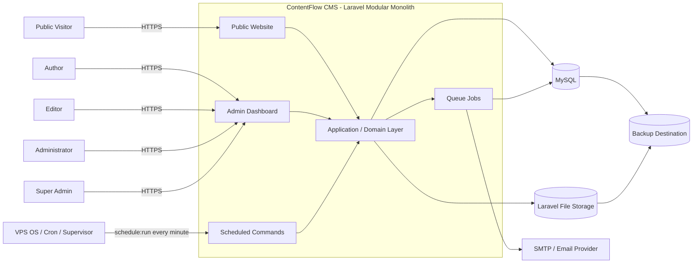

### Context Rules

- Public visitors never access the database directly.
- Administrative users never bypass Laravel authorization.
- SMTP is an integration, not a source of truth.
- File storage is accessed through Laravel's filesystem abstraction.
- MySQL is the authoritative state store for the MVP.
- Backup storage is operational infrastructure, not part of user-facing application behavior.

---

# 3. Application Architecture

## 3.1 Logical Layers

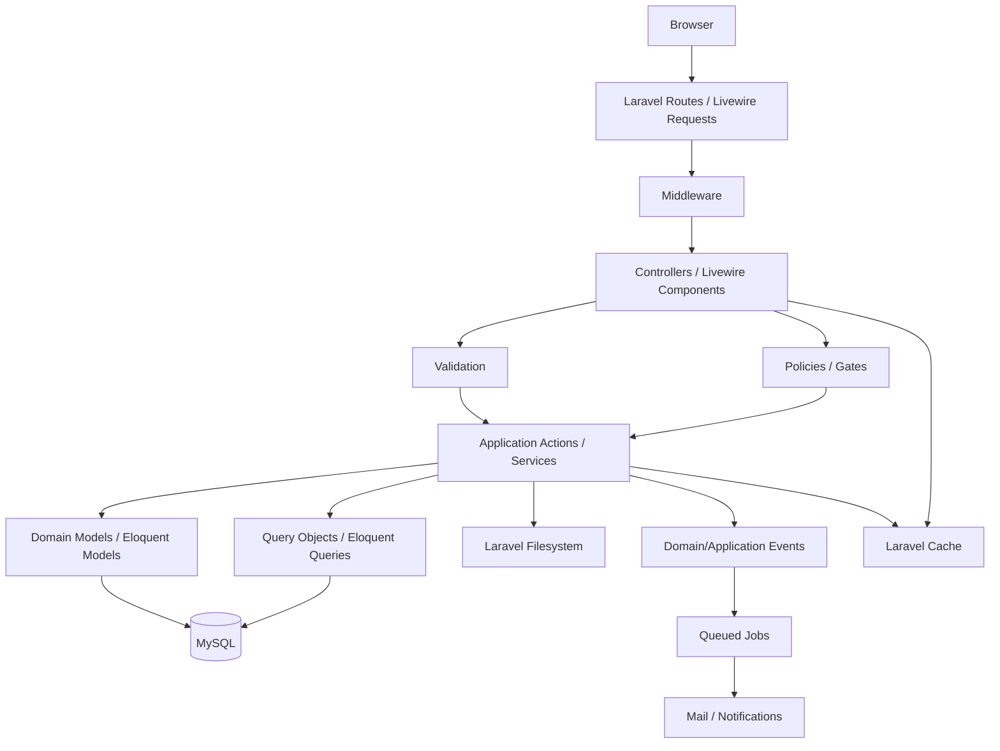

## 3.2 Responsibilities

### Routes

Responsibilities:

- map HTTP endpoints to controllers/components;
- name routes consistently;
- group admin routes behind authentication middleware;
- avoid business logic.

### Middleware

Responsibilities:

- authentication;
- CSRF and session-related framework concerns;
- rate limiting where needed;
- request-level contextual concerns.

Middleware shall not replace Policies for resource-level authorization.

### Controllers / Livewire Components

Responsibilities:

- receive user intent;
- collect validated input;
- invoke authorization;
- call an Action/Service;
- return UI state/response;
- manage pagination/filter UI.

They shall not contain complex publishing, moderation, role, or data-integrity rules.

### Form Requests / Livewire Validation

Responsibilities:

- input shape;
- required fields;
- format validation;
- allowed values;
- basic uniqueness rules.

Domain state rules may still be enforced by Actions.

### Policies / Gates

Responsibilities:

- permission enforcement;
- ownership decisions;
- resource-level authorization.

### Application Actions / Services

Responsibilities:

- implement meaningful use cases;
- enforce workflow/state rules;
- define transaction boundaries;
- trigger domain/application events;
- invalidate relevant caches.

Examples:

```text
PublishPost
SchedulePost
ArchivePost
ModerateComment
UpdateSiteSettings
ChangeUserStatus
AssignRole
UpdateMenuStructure
DeleteReferencedMedia
```

Only actions with real business value shall be created.

### Eloquent Models

Responsibilities:

- persistence mapping;
- relationships;
- simple state/query helpers;
- small invariants where natural.

Models shall not become large "god objects".

### Query Objects

Query objects may be introduced when admin listing/filter queries become sufficiently complex.

Examples:

```text
PostIndexQuery
MediaLibraryQuery
CommentModerationQuery
DashboardSummaryQuery
```

They are optional, not mandatory for simple queries.

---

# 4. Module Architecture

## 4.1 Module Map

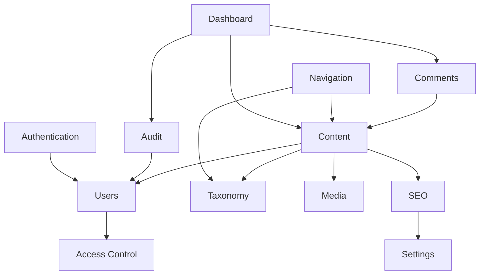

## 4.2 Initial Module Responsibilities

| Module | Owns |
|---|---|
| Authentication | Login, logout, password recovery |
| Users | User profile/state, activation |
| Access Control | Roles, permissions, policies |
| Content | Posts, pages, publishing state |
| Taxonomy | Categories, tags |
| Media | Uploads, metadata, references |
| Comments | Submission and moderation |
| Navigation | Menus and menu items |
| SEO | Per-content metadata and global SEO behavior |
| Settings | Site-level configuration |
| Dashboard | Operational summaries and shortcuts |
| Audit | Activity records for defined administrative actions |

## 4.3 Suggested Laravel Organization

The project may initially follow standard Laravel folders while using feature-oriented namespaces.

Example:

```text
app/
├── Actions/
│   ├── Content/
│   ├── Comments/
│   ├── Settings/
│   ├── Users/
│   └── Navigation/
├── Livewire/
│   ├── Admin/
│   │   ├── Posts/
│   │   ├── Pages/
│   │   ├── Media/
│   │   ├── Comments/
│   │   ├── Users/
│   │   ├── Roles/
│   │   ├── Menus/
│   │   ├── Settings/
│   │   └── Dashboard/
│   └── Public/
├── Models/
├── Policies/
├── Queries/
├── Events/
├── Listeners/
├── Jobs/
├── Notifications/
└── Support/
```

This is preferred over creating separate Composer packages before real reuse requirements exist.

---

# 5. Domain Boundaries

## 5.1 Content Domain

Owns:

- Post;
- Page;
- post/page state;
- slug;
- publication date;
- content ownership;
- publishing transitions.

Depends on:

- Users for author identity;
- Taxonomy for classification;
- Media for media references;
- SEO for metadata.

It shall not own:

- user credential logic;
- menu structure;
- comment moderation logic;
- global site settings.

## 5.2 Taxonomy Domain

Owns:

- Category;
- Tag;
- taxonomy slug;
- relations from content to taxonomy.

Deletion must obey data-integrity rules.

## 5.3 Media Domain

Owns:

- media record;
- file metadata;
- file path/storage key;
- alt text;
- usage/reference checks.

The domain exposes media references to Content, SEO, and Settings.

## 5.4 Comments Domain

Owns:

- comment submission;
- moderation state;
- public visibility rule.

Valid states:

```text
Pending
Approved
Spam
Rejected
```

Only Approved comments are public.

## 5.5 Access Domain

Owns:

- Role;
- Permission;
- user-role assignment;
- role-permission assignment;
- policy-level capability mapping.

It does not own authentication sessions.

## 5.6 Settings Domain

Owns site-level configuration such as:

- site name;
- site description;
- logo reference;
- favicon;
- contact information;
- default SEO values;
- social links;
- basic content settings;
- site timezone where product-controlled.

## 5.7 Audit Domain

Owns operational activity records, separate from technical logs.

---

# 6. Data Flow

## 6.1 Create or Edit Post

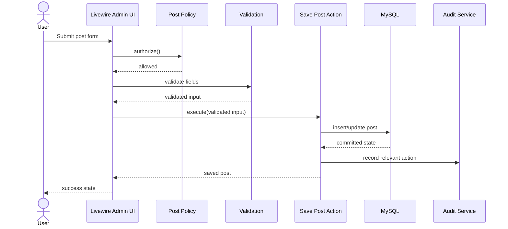

## 6.2 Public Content Read

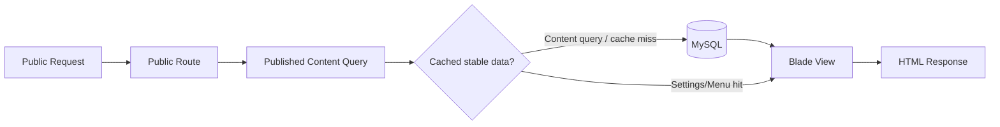

Public queries shall always apply publication visibility rules.

## 6.3 Settings Read Flow

```text
Request
→ Settings Reader
→ Cache
   → hit: return cached settings
   → miss: read MySQL → cache → return
```

Settings writes shall invalidate relevant settings cache.

---

# 7. Request Lifecycle

## 7.1 Admin Request Lifecycle

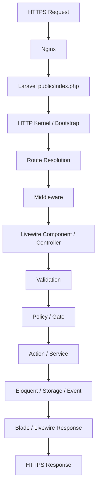

### Request Rules

1. authentication middleware protects admin routes;
2. resource authorization is still enforced with Policies/Gates;
3. validation occurs before state-changing actions;
4. Actions implement meaningful business transitions;
5. database transactions are used when partial writes would be invalid;
6. external side effects should occur after a successful commit;
7. user success feedback only appears after successful persistence.

---

# 8. Authentication Flow

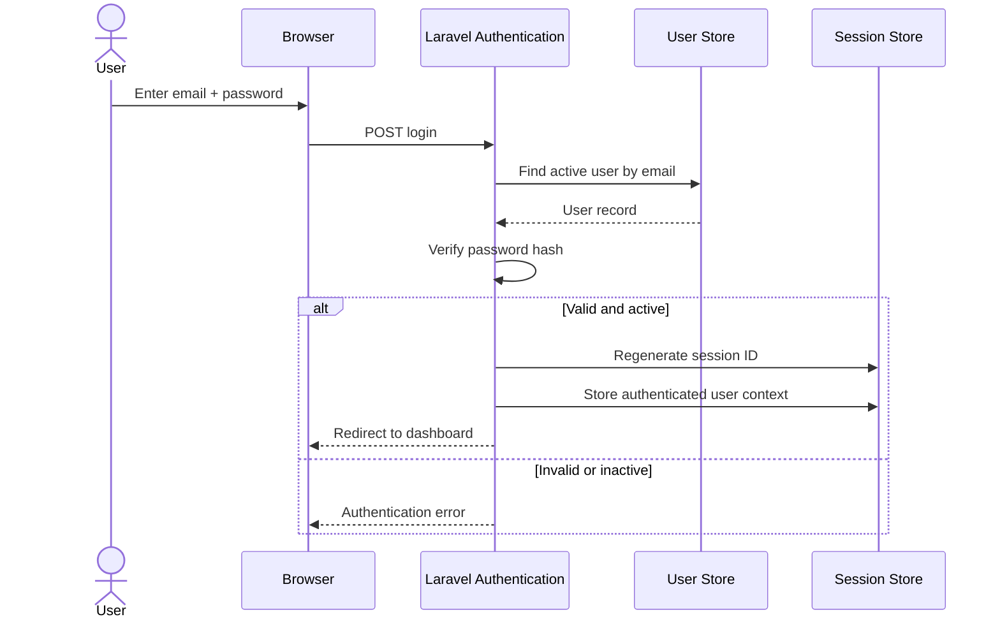

### Authentication Boundaries

- password hashing uses Laravel-supported hashing;
- login is rate limited;
- inactive users cannot authenticate;
- password reset uses Laravel-native mechanisms where possible;
- logout invalidates the session;
- production cookies use HTTPS-appropriate security settings.

---

# 9. Authorization Flow

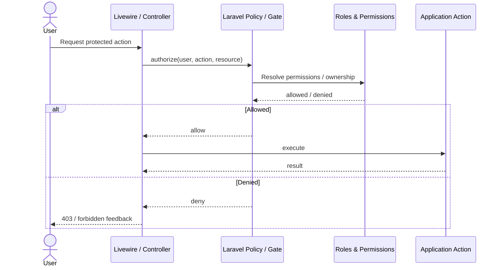

### Authorization Rules

- UI hiding is convenience, not security.
- Direct URL/request access is independently authorized.
- Author ownership rules are evaluated server-side.
- Default roles group permissions; permission is the underlying capability unit.
- Permission changes apply to subsequent requests.

---

# 10. Business Logic Flow

## 10.1 Publishing State Machine

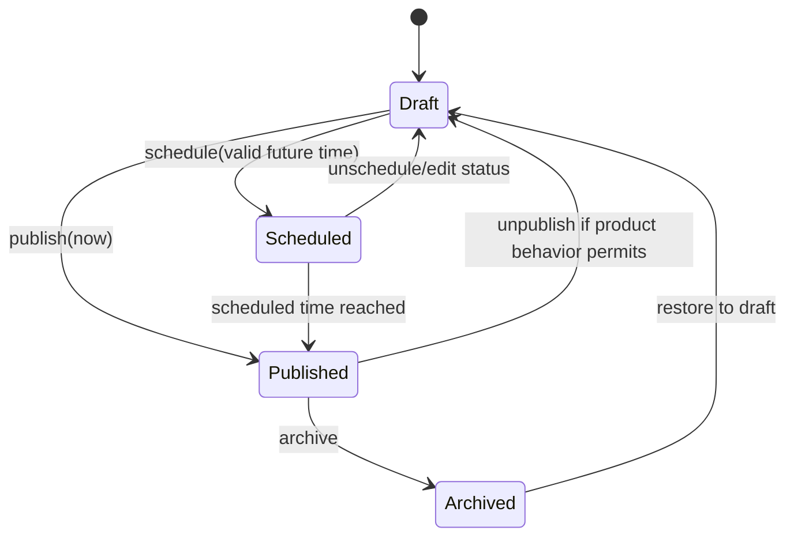

The exact allowed reverse transitions shall be kept consistent with PRD/SRS acceptance criteria. Any transition not required by the product must not be added casually.

## 10.2 Publish Action

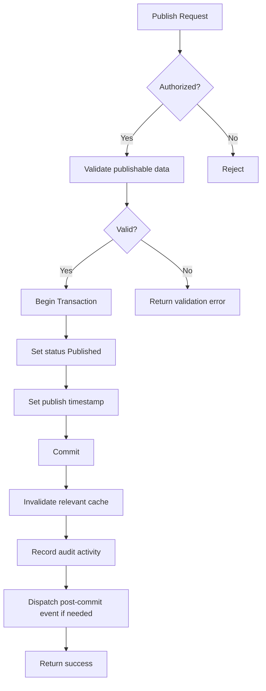

### Business Logic Placement

- UI: interaction only.
- Policy: "may this user do this?"
- Validation: "is input structurally valid?"
- Action: "is this business transition allowed and how is it executed?"
- Model: relationships/state helpers.
- Event/listener: decoupled post-success side effects.

---

# 11. Notification Flow

The MVP distinguishes between immediate UI feedback and asynchronous email notification.

## 11.1 In-App Feedback

```text
User action
→ validate
→ authorize
→ execute
→ success/failure result
→ Livewire flash/toast/inline feedback
```

No persistent notification center is required.

## 11.2 Email Notification

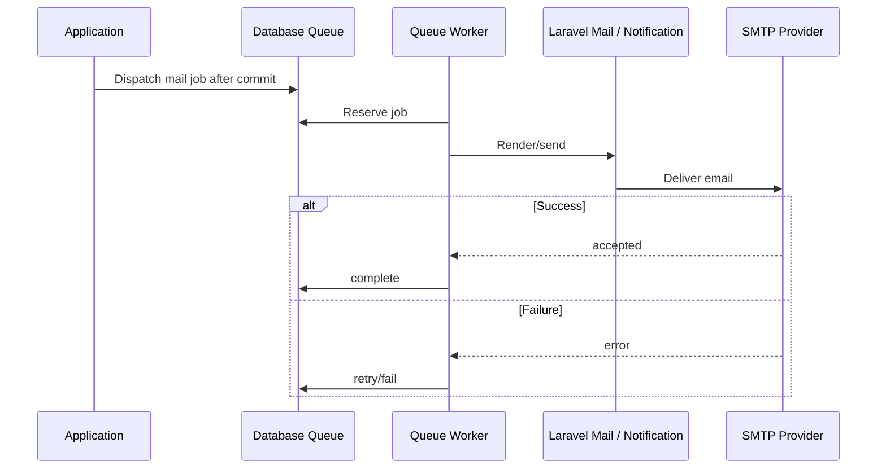

Password-reset behavior may use Laravel's native notification pipeline.

---

# 12. File Storage Flow

## 12.1 Upload

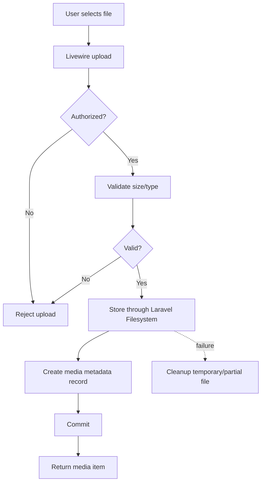

## 12.2 Storage Boundary

Application business logic shall use a logical disk/storage abstraction, not hard-coded OS paths.

Initial production storage:

```text
Laravel Filesystem
    └── local/public disk on VPS
```

Future:

```text
Laravel Filesystem
    ├── local
    └── S3-compatible object storage
```

## 12.3 Deletion

Before deleting a media record/file:

1. authorize;
2. check references;
3. if referenced, require explicit resolution/warning;
4. delete file and metadata consistently;
5. record relevant activity where required.

A failed file operation must not leave a valid-looking media record.

---

# 13. Reporting Flow

MVP reporting is operational.

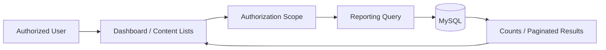

### Reporting Sources

- published count;
- draft count;
- scheduled count;
- pending comments;
- filtered post lists;
- recent content;
- scheduled content.

No data warehouse or analytics pipeline is required for MVP.

---

# 14. Background Job Flow

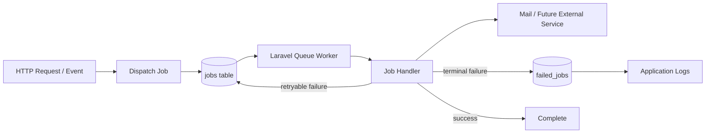

### Job Candidates

MVP:

- queued transactional email where applicable.

Future:

- media transformations;
- export generation;
- webhook delivery;
- large import tasks.

### Job Rules

- core post save is synchronous;
- job payloads should use stable identifiers rather than large serialized object graphs;
- jobs should be idempotent where practical;
- side effects should be dispatched after database commit;
- retries must not duplicate business events.

---

# 15. Scheduled Task Architecture

Laravel Scheduler is the only application scheduler.

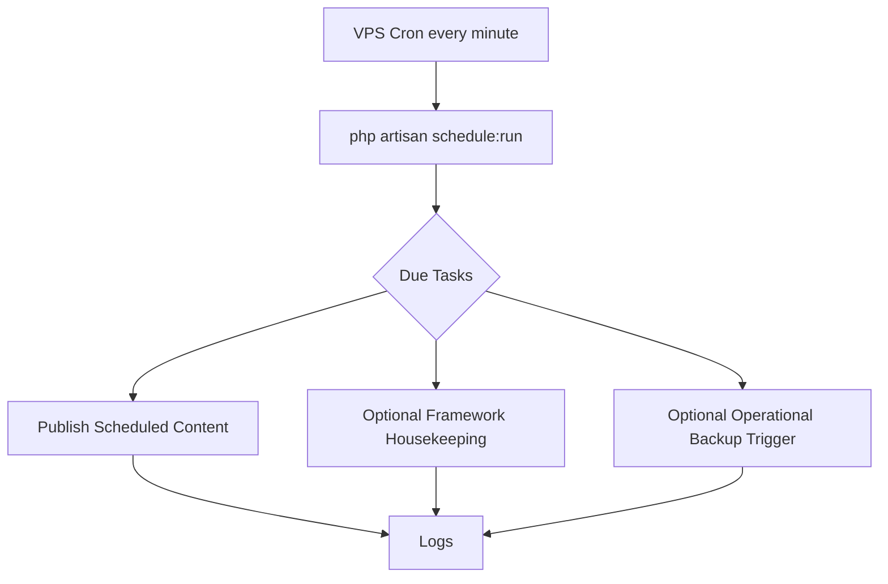

## 15.1 Scheduled Publishing

Algorithm:

```text
Find posts where:
status = Scheduled
AND publish_at <= now(site/application timezone)

For each eligible post:
    re-check eligibility
    execute PublishPost action
    avoid duplicate publication side effects
```

### Scheduler Rules

- avoid overlapping executions where state could conflict;
- scheduler failure is logged;
- only implemented features register scheduled tasks;
- business logic is reused through actions rather than duplicated inside scheduler commands.

---

# 16. Integration Architecture

## 16.1 MVP External Integrations

Required:

- SMTP-compatible email provider.

Operational:

- backup destination when available.

No external integration is allowed to become a hard dependency for core content operations.

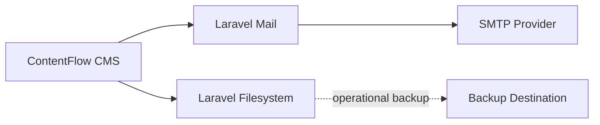

## 16.2 Future Integration Seams

Future APIs/webhooks may connect through:

```text
HTTP API Controller
      ↓
Authorization
      ↓
Existing Application Actions
      ↓
Domain / Eloquent
```

and:

```text
Domain Event
    ↓
Queued Webhook Job
    ↓
Signed HTTP Request
```

The existing business logic must be reused rather than rewritten specifically for integrations.

---

# 17. Database Architecture

## 17.1 Database Role

MySQL is the authoritative transactional database.

## 17.2 Conceptual Data Model

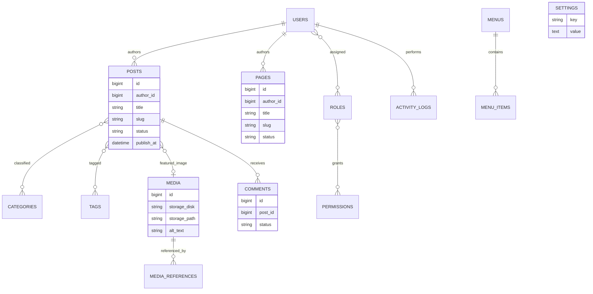

This diagram is conceptual, not a final database schema.

## 17.3 Data Ownership

| Data | Authoritative Owner |
|---|---|
| Authentication identity | Users |
| Roles/permissions | Access Control |
| Posts/pages | Content |
| Category/tag | Taxonomy |
| Media metadata | Media |
| Comments | Comments |
| Menus | Navigation |
| Global configuration | Settings |
| Audit events | Audit |

## 17.4 Integrity Strategy

Use:

- foreign keys where appropriate;
- unique indexes for stable unique identifiers such as email and applicable slug namespaces;
- transactions for multi-record invariants;
- explicit delete behavior;
- controlled reassignment rather than silent ownership loss;
- indexes for measured filters/search patterns.

## 17.5 Time Strategy

The application shall use one consistent storage/comparison strategy for timestamps. User-visible scheduled times must be interpreted against the configured site/application timezone.

The exact database timezone convention shall be fixed during implementation and documented, with UTC storage strongly preferred where Laravel/application behavior remains consistent.

---

# 18. Cache Architecture

## 18.1 Cache Role

Cache accelerates stable reads but never becomes authoritative.

Initial candidates:

- site settings;
- menus;
- public taxonomy lists;
- stable SEO defaults.

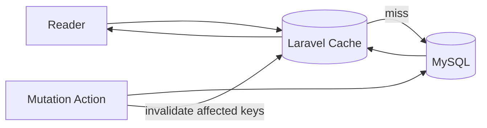

## 18.2 Cache Key Strategy

Conceptual namespaces:

```text
settings:site
settings:seo
menu:{menu_id}
taxonomy:categories
taxonomy:tags
```

Avoid caching large dynamic editorial result sets prematurely.

## 18.3 Driver

MVP can use:

- database cache; or
- file cache.

Database cache is the preferred shared-state option on a single VPS without Redis.

## 18.4 Cache Correctness Rule

Running cache clear must not break product correctness.

---

# 19. Queue Architecture

## 19.1 Driver

MVP default:

```text
Laravel Queue
    ↓
database driver
    ↓
jobs table
```

## 19.2 Worker

A supervised process shall run the queue worker.

Conceptual production process:

```text
Supervisor/Systemd
    └── php artisan queue:work
```

The exact process manager is an operational choice.

## 19.3 Queue Boundaries

Queued:

- non-blocking emails;
- future exports;
- future webhooks;
- future media transformations.

Synchronous:

- authentication result;
- post save;
- publish state change;
- permission updates;
- site-setting writes;
- comment moderation.

## 19.4 Future Upgrade

If measured workload justifies it:

```text
Database Queue
      ↓
Redis Queue
```

The job contracts should not depend on database-specific queue behavior.

---

# 20. Logging Architecture

Two different logging concerns must remain distinct.

## 20.1 Technical Logs

Purpose:

- debugging;
- operational diagnosis;
- failure monitoring.

Sources:

- exceptions;
- queue failures;
- scheduler failures;
- storage failures;
- mail failures;
- selected security anomalies.

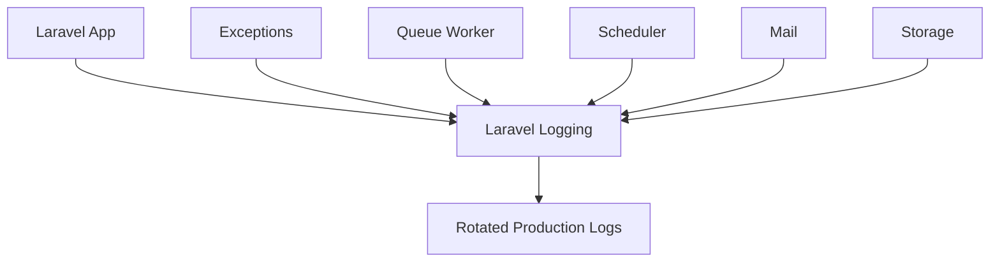

## 20.2 Activity/Audit Logs

Purpose:

- "who changed what and when?"

Examples:

- post published;
- post archived;
- user created;
- user activated/deactivated;
- roles/permissions changed;
- settings updated.

Stored in application data, not technical log files.

## 20.3 Sensitive Data

Never intentionally log:

- plaintext passwords;
- session cookie values;
- `.env` secrets;
- database passwords;
- SMTP credentials;
- private API credentials.

---

# 21. Error Handling Architecture

## 21.1 Error Categories

```text
Validation Error
Authentication Error
Authorization Error
Not Found
Conflict / Invalid Domain Transition
Storage Error
Mail/Queue Error
Unexpected System Exception
```

## 21.2 Flow

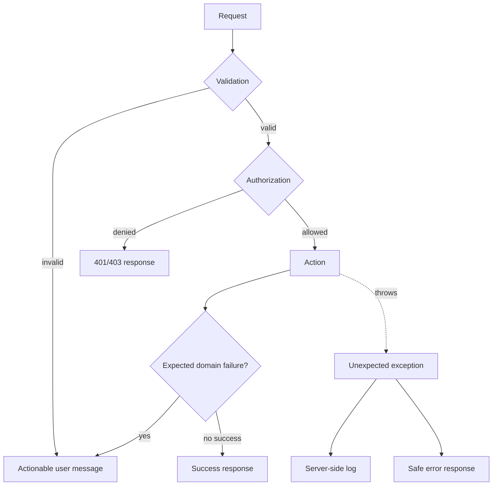

## 21.3 Design Rules

- do not expose stack traces in production;
- preserve form input where practical;
- do not show success if transaction failed;
- use product-appropriate 404/500 pages;
- distinguish expected validation/domain errors from system failures;
- failed upload must not create phantom media;
- optional request/correlation IDs may support technical support.

---

# 22. Backup Architecture

Backup is operational, not an admin-MVP feature.

```mermaid
flowchart LR
    DB[(MySQL)]
    Files[(Uploaded Media)]
    DBBackup[Database Dump]
    FileBackup[Media Backup]
    BackupDest[(Separate Backup Destination)]
    Restore[Documented Restore Process]

    DB --> DBBackup --> BackupDest
    Files --> FileBackup --> BackupDest
    BackupDest --> Restore
```

## 22.1 Required Backup Sets

1. MySQL data.
2. User-uploaded files.
3. Secure recovery of environment-specific secrets/configuration outside normal source control.

## 22.2 Not Required

Application source backup is unnecessary as a runtime feature if source and release artifacts are safely version-controlled.

## 22.3 Restore Requirement

At least one restore procedure shall be tested before commercial production release.

## 22.4 Retention

Retention is defined per installation/deployment policy and must prevent uncontrolled storage growth.

---

# 23. Security Boundaries

## 23.1 Boundary Diagram

```mermaid
flowchart TB
    Internet((Internet))
    TLS[TLS / Nginx]
    Public[Public Routes]
    Admin[Authenticated Admin Routes]
    AuthZ[Policies / Gates]
    App[Application Actions]
    DB[(MySQL)]
    PublicStorage[(Public Media)]
    PrivateStorage[(Private Storage)]
    Secrets[Environment Secrets]
    SMTP[SMTP Provider]

    Internet --> TLS
    TLS --> Public
    TLS --> Admin
    Admin --> AuthZ --> App
    Public --> App
    App --> DB
    App --> PublicStorage
    App --> PrivateStorage
    App --> SMTP
    Secrets -. loaded by runtime .-> App
```

## 23.2 Trust Boundaries

### Internet Boundary

Untrusted:

- HTTP request input;
- uploaded files;
- comment submissions;
- query parameters.

Controls:

- TLS;
- validation;
- CSRF for state-changing web requests;
- rate limiting;
- output escaping/sanitization appropriate to content type.

### Admin Boundary

Requires:

- authenticated session;
- active account;
- policy/gate authorization.

### File Boundary

Uploads are untrusted.

Controls:

- allowlisted file types;
- max size;
- intended storage path;
- no executable media uploads;
- public/private separation.

### Secret Boundary

Production secrets:

- never committed;
- never rendered publicly;
- loaded from deployment environment.

### Database Boundary

Only the application/database operational account connects to MySQL. MySQL should not be publicly exposed unnecessarily.

## 23.3 Rich Content

Because CMS content may contain rich text/markup, rendering rules must prevent unauthorized script execution while preserving intended editor capabilities.

---

# 24. Deployment Architecture

## 24.1 Initial VPS Deployment

```mermaid
flowchart TB
    Internet((Internet))
    DNS[DNS]
    Nginx[Nginx + TLS]
    PHP[PHP-FPM / Laravel]
    Worker[Queue Worker]
    Cron[Cron]
    DB[(MySQL 8.4 target)]
    Storage[(Local Laravel Storage)]
    Logs[(Rotated Logs)]
    SMTP[SMTP Provider]
    Backup[(External/Separate Backup)]

    Internet --> DNS --> Nginx
    Nginx --> PHP
    PHP --> DB
    PHP --> Storage
    PHP --> SMTP
    Worker --> DB
    Worker --> SMTP
    Cron -->|schedule:run| PHP
    PHP --> Logs
    Worker --> Logs
    DB --> Backup
    Storage --> Backup
```

## 24.2 VPS Runtime Responsibilities

- Nginx serves HTTPS and Laravel public assets;
- PHP runs Laravel requests;
- MySQL stores application state;
- queue worker executes asynchronous jobs;
- cron invokes Laravel Scheduler every minute;
- storage contains uploaded media;
- logs rotate;
- backups execute according to operational policy.

## 24.3 Release Flow

```text
Prepare release
→ install locked PHP dependencies
→ build locked frontend assets
→ enable maintenance strategy if required
→ deploy application files
→ run controlled migrations
→ refresh Laravel production caches
→ restart/reload queue workers
→ verify health endpoint
→ smoke-test core flows
→ complete deployment
```

The exact deployment automation can evolve later.

## 24.4 Network Exposure

Public:

- 80 only for redirect/ACME as required;
- 443 HTTPS;
- SSH restricted operationally.

Not publicly exposed by default:

- MySQL;
- internal queue worker;
- filesystem internals;
- `.env`.

---

# 25. Scalability Strategy

The initial strategy is **vertical first, horizontal-ready without premature distribution**.

## Stage 1 — MVP

```text
Single VPS
├── Nginx
├── PHP
├── MySQL
├── Queue Worker
└── Local Storage
```

Optimize:

- correct indexes;
- pagination;
- eager loading;
- caching stable configuration;
- queued non-blocking work.

## Stage 2 — Increased Load

Possible changes only when metrics justify them:

```text
Larger VPS
More PHP workers
More queue workers
Database tuning
Redis for cache/session/queue
CDN for public static/media assets
```

## Stage 3 — Horizontal Web Tier

```mermaid
flowchart TB
    LB[Load Balancer]
    W1[Laravel Web 1]
    W2[Laravel Web 2]
    Redis[(Redis - if justified)]
    DB[(Managed / Dedicated MySQL)]
    Obj[(Object Storage)]
    Workers[Queue Workers]

    LB --> W1
    LB --> W2
    W1 --> Redis
    W2 --> Redis
    W1 --> DB
    W2 --> DB
    W1 --> Obj
    W2 --> Obj
    Workers --> Redis
    Workers --> DB
```

This stage is future architecture, not MVP infrastructure.

## Scalability Rules

- no process-local state as source of truth;
- filesystem access through Laravel abstraction;
- jobs independent from web process;
- search boundary remains replaceable;
- cache optional for correctness;
- avoid vendor-specific coupling in core domain behavior.

---

# 26. Future SaaS/Multi-Tenant Considerations

SaaS and multi-tenancy are explicitly outside MVP.

The current architecture should avoid blocking future SaaS, but must not implement tenant complexity early.

## 26.1 Future Logical Hierarchy

```text
Account / Tenant
    ├── Sites
    │    ├── Content
    │    ├── Media
    │    ├── Menus
    │    ├── Settings
    │    └── SEO
    ├── Users
    ├── Subscription
    └── Usage / Quotas
```

## 26.2 Decisions to Defer

Do not choose yet:

- shared-schema vs database-per-tenant;
- tenant domain routing implementation;
- SaaS billing provider;
- quota engine;
- tenant-scoped queue architecture;
- per-tenant storage bucket strategy.

Those choices require real SaaS requirements.

## 26.3 Current Design Practices That Help Later

- keep site settings behind a Settings module;
- avoid global static state in domain logic;
- use filesystem abstraction;
- keep business logic in actions rather than UI;
- avoid hard-coded installation-specific branding;
- use stable IDs/relationships;
- keep API/webhook future flows routed through existing actions;
- keep query logic extractable.

## 26.4 Migration Path

Conceptually:

```text
Single Installation
      ↓
Introduce explicit Site boundary
      ↓
Tenant owns one/more Sites
      ↓
Tenant-scoped authorization/data access
      ↓
Plans / Billing / Quotas
      ↓
ContentFlow Cloud
```

No tenant_id column should be added to every table in MVP without an approved SaaS design.

---

# 27. Architecture Decisions

The following decisions function as lightweight Architecture Decision Records (ADRs).

## ADR-001 — Modular Monolith

**Decision:** Use one Laravel application with logical modules.

**Reason:**
- MVP scope fits one application;
- simpler deployment;
- simpler transactions;
- lower operational cost;
- easier commercial source-code distribution.

**Status:** Accepted.

---

## ADR-002 — Laravel-Native First

**Decision:** Prefer Laravel routes, middleware, policies, Eloquent, events, queues, scheduler, filesystem, cache, mail, and logging.

**Reason:** minimizes dependencies and improves upgradeability.

**Status:** Accepted.

---

## ADR-003 — Blade + Livewire Administration

**Decision:** Use server-driven Laravel UI with Blade + Livewire + Tailwind + Alpine.

**Reason:**
- fits CRUD/editorial workflows;
- avoids separate SPA/API architecture;
- reduces duplicated validation/auth logic;
- aligns with requested stack.

**Status:** Accepted.

---

## ADR-004 — MySQL as Primary Source of Truth

**Decision:** Use MySQL for core relational application state.

**Reason:** content, users, roles, comments, taxonomy, menus, and audit data are relational and transactional.

**Status:** Accepted.

---

## ADR-005 — No Repository per Model

**Decision:** Do not wrap every Eloquent model with repository interfaces.

**Reason:** adds ceremony without solving a real MVP requirement.

**Trigger to revisit:** interchangeable persistence source or genuinely complex persistence boundary.

**Status:** Accepted.

---

## ADR-006 — Selective Action/Service Layer

**Decision:** Create actions for meaningful business operations, not every CRUD method.

**Reason:** keeps business workflows reusable and testable without over-abstraction.

**Status:** Accepted.

---

## ADR-007 — Database Queue for MVP

**Decision:** Use Laravel database queue.

**Reason:**
- no Redis operational dependency;
- sufficient for low/moderate asynchronous workload;
- Laravel-native.

**Trigger to revisit:** measured throughput/latency requires Redis.

**Status:** Accepted.

---

## ADR-008 — MySQL Search First

**Decision:** Use Eloquent/MySQL search and filtering.

**Reason:** MVP search requirements are simple.

**Trigger to revisit:** large content corpus or advanced full-text relevance requirements exceed MySQL solution.

**Status:** Accepted.

---

## ADR-009 — Local Filesystem through Laravel Abstraction

**Decision:** Start with VPS local storage but access it exclusively through Laravel filesystem abstractions.

**Reason:** simplest MVP while preserving S3-compatible migration path.

**Status:** Accepted.

---

## ADR-010 — Cache Stable Configuration, Not Everything

**Decision:** cache settings, menus, stable taxonomy/SEO defaults selectively.

**Reason:** avoids cache invalidation complexity while gaining predictable benefit.

**Status:** Accepted.

---

## ADR-011 — Scheduler Drives Scheduled Publishing

**Decision:** use Laravel Scheduler invoked every minute by VPS cron.

**Reason:** native, simple, sufficient.

**Status:** Accepted.

---

## ADR-012 — Public API/Webhooks Deferred

**Decision:** do not build an API or webhook framework in MVP.

**Reason:** PRD does not require them.

**Future rule:** reuse application actions when integrations arrive.

**Status:** Accepted.

---

## ADR-013 — SaaS/Multi-Tenancy Deferred

**Decision:** do not add tenant infrastructure to MVP.

**Reason:** SaaS is future scope and tenant model is not yet defined.

**Status:** Accepted.

---

## ADR-014 — Technical Logs and Audit Logs Are Separate

**Decision:** operational system logs and business activity logs have distinct stores/purposes.

**Reason:** different audience, retention, and semantics.

**Status:** Accepted.

---

# 28. Architecture Trade-Offs

## 28.1 Modular Monolith vs Microservices

### Chosen: Modular Monolith

Advantages:

- lower deployment complexity;
- simple database transactions;
- easier debugging;
- easier testing;
- easier source-code distribution;
- fewer production failure modes.

Trade-off:

- modules are not independently deployable.

Why acceptable:

The MVP has no requirement for independent scaling/deployment per domain.

---

## 28.2 Livewire vs SPA Frontend

### Chosen: Blade + Livewire

Advantages:

- one Laravel application;
- shared authentication/authorization;
- less API ceremony;
- strong fit for admin CRUD;
- lower frontend state complexity.

Trade-off:

- less suitable for highly client-heavy collaborative applications.

Why acceptable:

Real-time collaborative editing is out of scope.

---

## 28.3 Database Queue vs Redis Queue

### Chosen: Database Queue

Advantages:

- no extra service;
- easy VPS deployment;
- sufficient for MVP email workload.

Trade-off:

- lower throughput and more database contention at larger scale.

Mitigation:

Move to Redis after measured need.

---

## 28.4 MySQL Search vs Dedicated Search Engine

### Chosen: MySQL

Advantages:

- one source/system;
- simple deployment;
- exact requirements are basic search/filtering.

Trade-off:

- weaker advanced relevance, typo tolerance, and large-corpus search.

Mitigation:

Keep search logic behind dedicated query/search services when complexity grows.

---

## 28.5 Local Storage vs Object Storage

### Chosen: Local VPS storage initially.

Advantages:

- simplest deployment;
- no external storage account;
- low cost.

Trade-off:

- harder horizontal scaling;
- backup responsibility;
- VPS disk capacity.

Mitigation:

Use Laravel Filesystem from day one.

---

## 28.6 Role/Permission Model vs Hard-Coded Roles

### Chosen: Permission model grouped by roles.

Advantages:

- meets PRD;
- supports agency/client customization;
- separates capability from role label.

Trade-off:

- more complexity than four hard-coded role checks.

Why acceptable:

Permissions are a core product requirement.

---

## 28.7 Actions/Services vs Fat Models

### Chosen: selective actions.

Advantages:

- explicit use cases;
- easier transaction boundaries;
- reusable across Livewire, scheduler, and future API.

Trade-off:

- introduces more classes.

Control:

Do not create action classes for trivial one-line CRUD operations.

---

## 28.8 Internal Audit Service vs Large Audit Package

### Chosen: lightweight internal approach first.

Advantages:

- exact fit to MVP requirements;
- fewer dependencies;
- predictable data.

Trade-off:

- fewer advanced audit features.

Why acceptable:

PRD explicitly states the audit trail is operational, not compliance-grade immutable logging.

---

## 28.9 Single VPS vs Cloud-Native Infrastructure

### Chosen: VPS.

Advantages:

- commercial installability;
- simple support model;
- low operating cost;
- matches requested deployment.

Trade-off:

- single-host failure domain;
- limited automatic scale.

Mitigation:

- backups;
- health checks;
- documented restoration;
- later separation of DB/storage/cache when justified.

---

# Final Architecture Summary

ContentFlow CMS V1 should be built as:

```text
                          CONTENTFLOW CMS
                    Laravel Modular Monolith
                               │
          ┌────────────────────┴────────────────────┐
          │                                         │
   Public Website                            Admin Dashboard
          │                                         │
          └────────────────────┬────────────────────┘
                               │
                     Policies + Validation
                               │
                    Application Actions
                               │
      ┌────────────────────────┼────────────────────────┐
      │                        │                        │
   Eloquent                 Filesystem              Events
      │                        │                        │
    MySQL                  Local Media            Queue Jobs
                                                       │
                                                   SMTP Mail

VPS Cron ───────────────► Laravel Scheduler ─────► Publishing Actions
Laravel Cache ──────────► Settings / Menu / Stable Lookup Acceleration
Technical Logs ─────────► Operational Diagnosis
Audit Logs ─────────────► Administrative Accountability
Backups ────────────────► MySQL + Uploaded Media
```

The architecture intentionally stops here for MVP.

The system shall gain Redis, object storage, dedicated search, external API, webhooks, horizontal web nodes, or multi-tenancy only after product requirements or measured production load justify them.

---

# Implementation Guardrails

Engineering should reject or challenge a proposed implementation when it:

- adds a microservice for an MVP module;
- introduces a third-party package for functionality already adequately handled by Laravel;
- creates one repository per Eloquent model without a real boundary;
- places publishing or permission business rules inside Blade templates;
- duplicates domain logic in Livewire and scheduled commands;
- bypasses Policies/Gates for protected actions;
- uses cache as the source of truth;
- hard-codes local file paths outside the storage abstraction;
- performs long/retryable external side effects inside a database transaction;
- introduces tenant columns before the SaaS architecture is approved;
- requires Redis/search infrastructure without measured need;
- expands the system beyond `docs/PRD.md` MVP scope.

The preferred implementation is the **smallest Laravel architecture that fully satisfies the PRD and SRS while preserving clear seams for commercial reuse and future evolution**.
